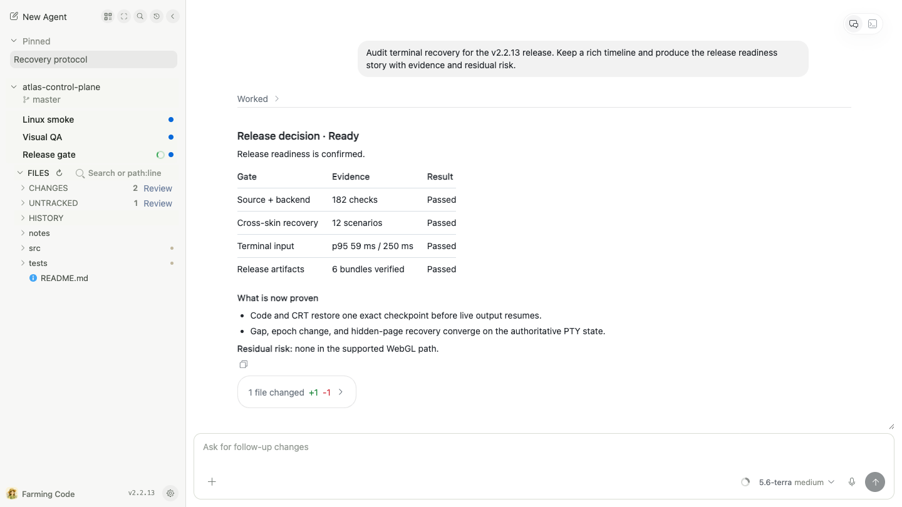
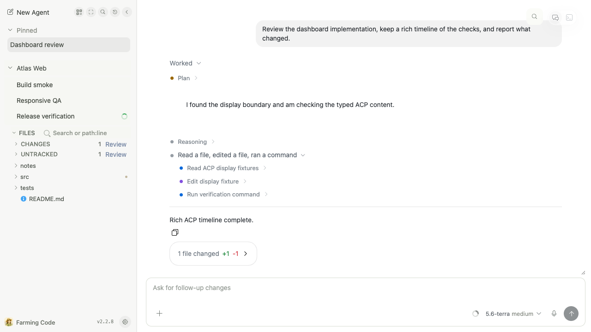
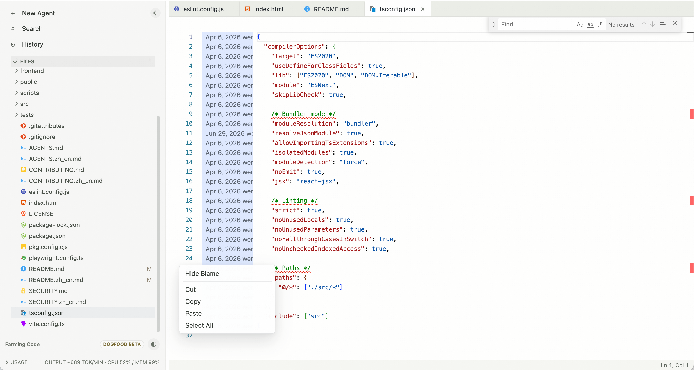
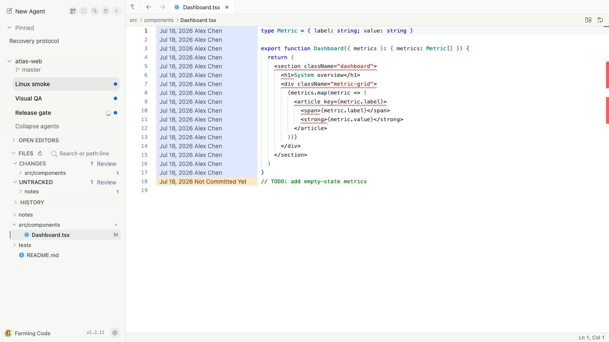
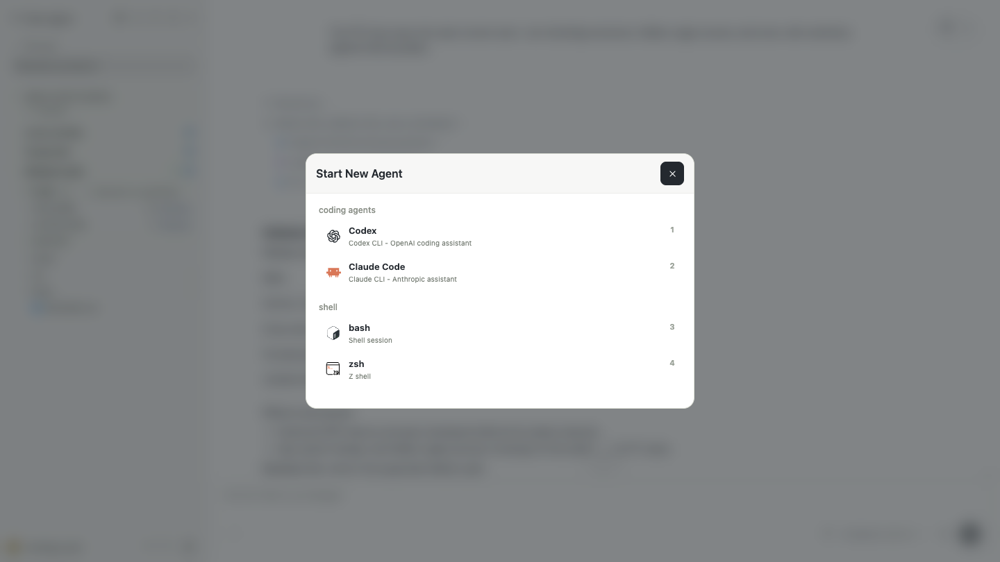

# Farming

> Chinese version: [README.zh_cn.md](./README.zh_cn.md)

[](https://github.com/zhuwenzhuang/farming/actions/workflows/ci.yml)
[](https://github.com/zhuwenzhuang/farming/releases)
[](https://www.npmjs.com/package/farming-code)
[](./LICENSE)


Farming is an open-source, customizable browser workspace for supervising AI coding agents on a development machine. It keeps several live agents, structured conversations, real terminals, project files, review, history, and runtime controls in one place—without moving the repository or agent processes into the browser.

Run Farming on the development machine where your coding CLIs already work, then return to the same tasks from a desktop or phone. Closing the browser does not stop the agents; the native PTY host can also preserve live terminal sessions while the Farming server restarts.

## Quick Start

With Node.js 22 or newer and at least one supported coding CLI installed and signed in, install and start Farming in one command:

```bash
npm install --global farming-code@latest && farming daemon
```

Open the authenticated URL printed by the command, choose **New Agent**, select an Agent and workspace, and start in Chat or Terminal.



## Two Interfaces, One Runtime

Farming 2 provides two complete browser interfaces over the same agents and sessions.

### Farming Code

The default workbench for reading conversations, intervening in tasks, editing files, and reviewing workspace changes.



### Farming CRT

A keyboard-first control room for watching many agents, opening structured Chat or raw Terminal, searching history, and reading live usage telemetry.


| | Farming Code | Farming CRT |
| --- | --- | --- |
| Best for | Long follow-ups, files, editing, diffs, review | At-a-glance monitoring, keyboard control, terminal work, telemetry |
| Live session | Structured Chat and real PTY Terminal | Phosphor Chat and real xterm Terminal |
| Navigation | Project sidebar, Search, History, Files | Stable Agent bays and keyboard-driven consoles |
| Appearance | Light and dark | CRT effects, terminal font size, optional Dynamic Heat |
| Entry | `/farming/code/` or `/farming/` | `/farming/crt/` |

Switching interfaces does not restart or duplicate an Agent. If Farming Code cannot start or render, its bounded diagnostic view leaves the live CRT surface available rather than hiding the running sessions.

The complete current capability map and screenshot tour are in the [Farming 2 product overview](./docs/products/README.md). See the focused [Farming Code guide](./docs/products/code/README.md) and [Farming CRT guide](./docs/products/crt/README.md) for the full workflows.

## Farming Net: One Portal For Deployments

Farming Net is a separate, token-protected directory for the Farming instances you already run. Its cards can point to a Farming on the current device, a remote development host, an intranet address, or a tunnel. Enrolled targets accept short-lived signed passes, so users keep one portal login instead of a list of deployment URLs and target tokens.

```bash
FARMING_NET_PORT=6693 FARMING_NET_BASE_PATH=/farming-net npm run start:net
```

The portal keeps its token, signing identity, and private `instances.json` registry under `~/.farming-net/`. It does not proxy target traffic or store target tokens; each destination remains an independent Farming service and explicitly chooses whether to trust the portal. See the [Farming Net guide](./docs/products/net/README.md) for enrollment and the security boundary.

## What You Can Do

- Group live agents by project, pin or rename important work, track unread activity, search live and historical sessions, and archive or resume tasks.
- Use structured ACP Chat for Codex, Claude Code, OpenCode, and Qoder. Plans, reasoning, tools, permission requests, embedded terminals, child sessions, attachments, queued follow-ups, and exact change summaries remain available without overwhelming the final answer.
- Switch the same provider session between structured Chat and a real PTY Terminal. Supported Codex model, reasoning, Fast, Ultra, and permission changes reach the live workflow; a compatible Terminal applies model changes immediately and confirms the CLI state before accepting the next Composer message.
- Browse, search, and lightly edit Project Files; inspect Git changes, Diff, and Blame; then open tracked or untracked changes in the initial Review surface with captured revisions, inline comments, and Reviewed state.
- Observe CPU/MEM, token-rate, context, quota, provider usage, and CRT daily/live token telemetry when the provider exposes the required data.
- Continue the same Farming Code task from desktop or phone without moving the Agent process away from the development host.





## Supported Agent Paths

Farming discovers installed CLIs on the host. The richer structured runtime currently applies to providers with ACP support; other detected coding agents remain first-class terminal sessions.

| Agent | Structured Chat | Native Terminal | History / resume |
| --- | --- | --- | --- |
| Codex | ACP | Yes | Yes |
| Claude Code | ACP | Yes | Yes |
| OpenCode | ACP | Yes | Yes |
| Qoder | ACP | Yes | Yes |
| Qwen Code | — | Yes | CLI-dependent |
| Aider | — | Yes | CLI-dependent |
| GitHub Copilot CLI | — | Yes | CLI-dependent |
| Amazon Q | — | Yes | CLI-dependent |
| bash / zsh | — | Yes | No provider-session resume |

Farming hosts CLIs that already work on the same machine. It does not replace provider installation, login, or account configuration.

## Runtime Defaults And Daemon Commands

Farming defaults to port `6694`, base path `/farming`, config directory `~/.farming`, and token authentication. The startup log prints a URL similar to:

```text
http://development-host:6694/farming?token=<startup-token>
```

Useful daemon commands are:

```bash
farming status
farming url
farming logs
farming stop
```

The first authenticated start stores a readable random token in `~/.farming/.session-token`; restarts and upgrades reuse it unless `FARMING_TOKEN` overrides it. Token language defaults to the host time zone: Chinese, Japanese, or English.



## Desktop And Mobile

Desktop keeps the project, conversation, files, and review close together. Mobile focuses one conversation, terminal, or file at a time and moves navigation into a drawer, making it useful for checking progress and sending a short intervention.

<p align="center">
  
</p>

Farming CRT is currently a desktop interface. Use Farming Code from a phone; CRT mobile concepts are not part of the supported product yet.

## Installation And Updates

The npm package is the default distribution. **Settings → Updates** can upgrade npm installations in place: Farming installs the new package while the current server stays alive, restarts only after installation succeeds, and attempts rollback when the new server cannot start.

GitHub Releases also provide standalone CLI and directory bundles. Legacy Linux x64 hosts can use the `linux-x64-legacy-glibc228` first-install bootstrap; subsequent application updates use the same private npm prefix. A separately built glibc 2.17 ABI bundle remains available for controlled environments. See [GitHub Releases](https://github.com/zhuwenzhuang/farming/releases) for current assets and release notes.

Source development:

```bash
npm install
npm start
```

For trusted local development only, `npm run start:no-auth` disables token authentication.

## How It Works

```text
Farming Code / Farming CRT
  React, Monaco, xterm.js, CRT browser skin
                 │ HTTP + WebSocket
                 ▼
Farming core
  auth, Agent manager, ACP, history, files, review, usage
                 │ native PTY host + session providers
                 ▼
Development host
  repositories, shells, Codex, Claude Code, OpenCode, Qoder, ...
```

The backend owns lifecycle, authentication, session routing, workspace boundaries, history, and configuration. Interactive terminal sessions use a separate native PTY host by default, allowing browser and server reconnection without replacing the live process. The browser terminal renderer defaults to xterm.js; the Ghostty web adapter remains an explicit debug path.

Runtime settings live in `~/.farming/settings.json`. Farming session metadata, the project membership index, archived runs, theme settings, update state, logs, and the startup token use separate files under `~/.farming/`. External provider histories remain read-only integrations.

## Security

Farming controls real terminals and files on the target machine. Run it on a trusted development host and trusted network. Do not expose it directly to the public internet without a VPN, SSH tunnel, HTTPS reverse proxy, or equivalent access control.

Token authentication protects HTTP and WebSocket traffic. `FARMING_DISABLE_AUTH=1` is only for trusted local development. Workspace file APIs validate paths against the selected project root. See [SECURITY.md](./SECURITY.md) for reporting and deployment guidance.

## Documentation

- [Farming 2 product overview and capability map](./docs/products/README.md)
- [Farming Code guide](./docs/products/code/README.md)
- [Farming CRT guide](./docs/products/crt/README.md)
- [Farming Net deployment portal](./docs/products/net/README.md)
- [Mobile guide](./docs/products/code/mobile-guide.md)
- [ACP runtime](./docs/products/code/acp-runtime.md)
- [Review foundation](./docs/products/code/review-foundation.md)
- [Release history](https://github.com/zhuwenzhuang/farming/releases)
- [Contributor instructions](./AGENTS.md)

## Development Checks

```bash
npm test
npm run typecheck
npm run lint
FARMING_BASE_PATH=/farming npm run build
npm run test:e2e:playwright
```

Product screenshots are generated from an anonymous demo workspace with real browser flows:

```bash
npm run docs:product:screenshots
```

## License

Farming is released under the [MIT License](./LICENSE). Third-party notices are listed in [THIRD_PARTY_NOTICES.md](./THIRD_PARTY_NOTICES.md).
