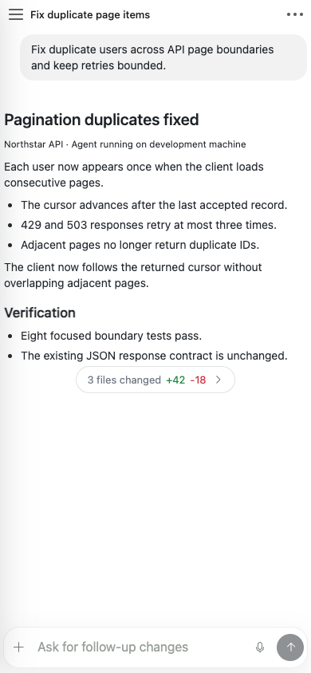

<p align="center">
  
</p>

<h1 align="center">Farming</h1>

<p align="center">
  Farming is an open-source remote web workbench for running and supervising AI coding agents on a development machine.
</p>

<p align="center"><a href="./README.zh_cn.md">简体中文</a></p>

<p align="center">
  <a href="https://github.com/zhuwenzhuang/farming/actions/workflows/ci.yml"></a>
  <a href="https://github.com/zhuwenzhuang/farming/releases"></a>
  <a href="https://www.npmjs.com/package/farming-code"></a>
  <a href="./LICENSE"></a>
  
  
</p>


Farming runs on the same development machine as your repositories and coding CLIs. Agent processes, terminals, and project files stay on that machine; a desktop or phone browser connects to those real sessions.

## Quick Start

With Node.js 22.13 LTS (22.x) or Node.js 24+ and at least one supported coding CLI installed and signed in:

```bash
npm install --global farming-code@latest && farming daemon
```

Open one of the authenticated URLs printed by the command, choose **New Agent**, then select a CLI, workspace, and Chat or Terminal. Closing the browser does not stop the Agent. In the same browser, revisit that address; on the development machine, this command prints the local address again:

```bash
farming url
```

For a new remote browser, use the authenticated **Network** URL printed when `farming daemon` starts. A VPN, SSH tunnel, or HTTPS reverse proxy can provide a stable reachable address, but the first visit still needs the Farming startup token.


## Farming Code

Farming Code is the default desktop and mobile interface. It groups work by project and keeps live Agents, resumable history, files, and review in the same browser workspace.

### Agents, Chat, and Terminal

Start or resume Codex, Claude Code, OpenCode, Qoder, and other detected coding CLIs. Supported Agents offer structured Chat for reading results and inspecting tool activity, plus a real Terminal for working directly with the CLI. Search and History cover both current work and resumable sessions.


### Files and Review

Browse, search, and lightly edit Project Files without leaving the current task. Inspect Git Changes, History, Diff, and Blame, then open a commit or working-copy change in Review.


## Supported Agents

Farming discovers installed CLIs on the host. Codex, Claude Code, OpenCode, and Qoder support both structured Chat and a native Terminal; other detected coding agents use the Terminal path.

| Agent | Structured Chat | Terminal | History / resume |
| --- | --- | --- | --- |
| Codex | Yes | Yes | Yes |
| Claude Code | Yes | Yes | Yes |
| OpenCode | Yes | Yes | Yes |
| Qoder | Yes | Yes | Yes |
| Qwen Code | — | Yes | CLI-dependent |
| Aider | — | Yes | CLI-dependent |
| GitHub Copilot CLI | — | Yes | CLI-dependent |
| Amazon Q | — | Yes | CLI-dependent |
| bash / zsh | — | Yes | No |

Farming hosts CLIs that already work on the same machine. It does not replace provider installation, login, or account configuration.

## Remote Use

Run Farming on the development machine and open its authenticated URL from any desktop or phone that can reach that machine:

```text
Desktop or phone browser
          │ HTTP / WebSocket
          ▼
Development machine
  Farming server
  ├── coding Agent processes
  ├── real terminals
  └── repositories and project files
```

The browser can disconnect and reconnect without stopping an Agent. A normal Farming server restart can also reconnect supported live terminal sessions. The desktop layout keeps projects, conversations, files, and review together; the mobile layout focuses one conversation, terminal, or file at a time.

<p align="center">
  
</p>

## Farming CRT

Farming CRT is an optional keyboard-first, retro control-room interface for scanning many Agents, opening their Chat or Terminal sessions, searching history, and viewing usage telemetry.


Code and CRT use the same backend Agents and sessions. Switching interfaces does not create a second Agent. Farming Code remains the default interface and the supported phone interface. See the [Farming CRT guide](./docs/products/crt/README.md) for controls and workflows.

## Farming Net

Farming Net is a separate, token-protected directory for Farming deployments. It provides one portal for opening registered instances without storing their target tokens or proxying their traffic. See the [Farming Net guide](./docs/products/net/README.md) for enrollment and security boundaries.

## Installation And Updates

The installed `farming` CLI defaults to port `6694`, base path `/farming`, config directory `~/.farming`, and token authentication. Useful daemon commands are:

```bash
farming status
farming url
farming logs
farming stop
```

The startup token is stored in `~/.farming/.session-token` and reused across restarts and upgrades. **Settings → Updates** can upgrade npm installations in place. npm updates first use the machine's configured registry and retry the registry shown in Settings only when that registry lacks the selected version. Before installing, Farming verifies that npm will update the same package root that launched the server. GitHub Releases also provide standalone CLI and directory bundles; see [GitHub Releases](https://github.com/zhuwenzhuang/farming/releases) for current artifacts.

To run from source with the same port and base path:

```bash
npm install
PORT=6694 FARMING_BASE_PATH=/farming npm start
```

For trusted local development only, `npm run start:no-auth` disables token authentication.

## Security

Farming controls real terminals and files on the development machine. Run it on a trusted host and network. Do not expose it directly to the public internet without a VPN, SSH tunnel, HTTPS reverse proxy, or equivalent access control.

Token authentication protects HTTP and WebSocket traffic. `FARMING_DISABLE_AUTH=1` is only for trusted local development. Workspace file APIs validate paths against the selected project root. See [SECURITY.md](./SECURITY.md) for reporting and deployment guidance.

## Documentation

- [Farming 2 product overview and capability map](./docs/products/README.md)
- [Farming Code guide](./docs/products/code/README.md)
- [Farming CRT guide](./docs/products/crt/README.md)
- [Farming Net deployment portal](./docs/products/net/README.md)
- [Mobile guide](./docs/products/code/mobile-guide.md)
- [ACP runtime](./docs/products/code/acp-runtime.md)
- [Review foundation](./docs/products/code/review-foundation.md)
- [Release history](https://github.com/zhuwenzhuang/farming/releases)
- [Contributor instructions](./AGENTS.md)

## Development Checks

```bash
npm test
npm run typecheck
npm run lint
FARMING_BASE_PATH=/farming npm run build
npm run test:e2e:playwright
```

Product screenshots are generated from an anonymous demo workspace with real browser flows:

```bash
npm run docs:product:screenshots
```

To refresh only selected files, pass a comma-separated list:

```bash
FARMING_SCREENSHOT_FILES=01-code-workspace.png npm run docs:product:screenshots
```

## License

Farming is released under the [MIT License](./LICENSE). Third-party notices are listed in [THIRD_PARTY_NOTICES.md](./THIRD_PARTY_NOTICES.md).
