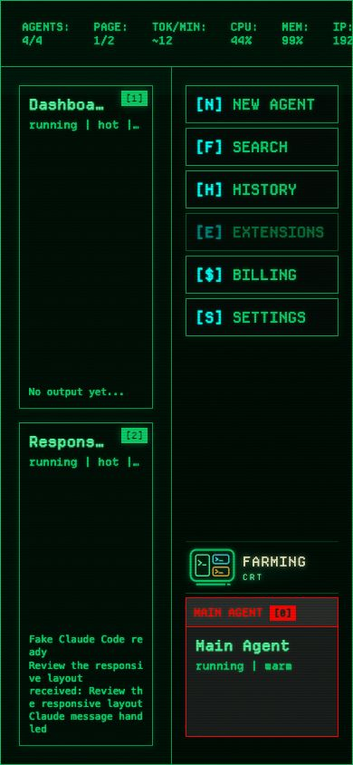

# Farming

> English version: [README.md](./README.md)

[](https://github.com/zhuwenzhuang/farming/actions/workflows/ci.yml)
[](https://github.com/zhuwenzhuang/farming/releases)
[](https://www.npmjs.com/package/farming-code)
[](./LICENSE)


Farming 是一个运行在开发机上的浏览器 AI Coding Agent 工作台。它把多个实时 Agent、结构化对话、真实终端、项目文件、Review、历史记录和运行时控制放在一起，同时代码仓库和 Agent 进程仍然留在开发机上。

把 Farming 运行在你平时使用 Coding CLI 的机器旁边，就可以从电脑或手机回到同一批工作。关闭浏览器不会停止 Agent；Farming Server 重启时，独立的原生 PTY Host 也可以保留正在运行的终端会话。

## 两套界面，同一套运行时

Farming 2 在同一批 Agent 和 Session 上提供两套完整的浏览器界面。

### Farming Code

默认工作台，适合阅读对话、介入任务、编辑文件，以及持续 Review 同一个演进中的修改。


### Farming CRT

键盘优先的控制室，适合同时观察多个 Agent、打开结构化 Chat 或原生 Terminal、搜索历史和查看实时用量遥测。


| | Farming Code | Farming CRT |
| --- | --- | --- |
| 更适合 | 长对话、文件、编辑、Diff、Review | 总览监控、键盘控制、终端操作、遥测 |
| 实时 Session | 结构化 Chat 与真实 PTY Terminal | 磷光风格 Chat 与真实 xterm Terminal |
| 导航方式 | 项目侧栏、Search、History、Files | 稳定 Agent 机位和键盘控制台 |
| 外观 | 浅色与深色 | CRT 效果、终端字号、可选 Dynamic Heat |
| 入口 | `/farming/code/` 或 `/farming/` | `/farming/crt/` |

切换界面不会重启或复制 Agent。如果 Farming Code 启动或渲染失败，有限范围的诊断层仍会保留后面的实时 CRT 界面，而不是把正在运行的 Session 一起遮掉。

完整能力矩阵和截图导览见 [Farming 2 产品总览](./docs/products/README.zh_cn.md)。两套界面的完整流程分别见 [Farming Code 指南](./docs/products/code/README.zh_cn.md) 和 [Farming CRT 指南](./docs/products/crt/README.zh_cn.md)。

## 现在可以做什么

- 按项目组织实时 Agent，置顶重点工作、重命名、查看未读状态，并归档或恢复任务。
- Codex、Claude Code、OpenCode 和 Qoder 使用结构化 ACP Chat。计划、推理、工具调用、权限请求、内嵌终端、子 Session、附件、排队追问和精确修改摘要都可以保留，但不会淹没最终答案。
- 需要原汁原味 CLI 行为时打开真实 PTY Terminal。Chat / Terminal 切换会改变实际运行时，并在身份可用时安全地恢复同一个 Provider Session。
- 修改运行中 Codex 所支持的模型、思考强度、Fast、Ultra 和权限设置。Terminal 的修改会在下一条消息前作用到当前工作流，而不是只改未来的启动 Profile。
- 浏览 Project Files 和 Open Editors，用 ripgrep 搜索、Monaco 轻量编辑、预览 Markdown/图片、跟随 `path:line` 链接，并检查 Git Changes、Diff 和 Blame。
- 围绕同一个演进中的 Change 跨 Revision Review，让 Finding 与对比版本绑定，标记文件已审阅，并关注多轮之间真正有意义的变化。
- 搜索实时 Agent 和受支持 Provider 的完整 Session 归档，然后打开、继续、恢复或 Resume 对应工作。
- 在 Provider 提供所需数据时查看 CPU/MEM、Token Rate、Context、Quota、Provider 用量，以及 CRT 的按日/实时 Token 遥测。
- 在电脑和手机浏览器中使用同一个服务；不同布局围绕不同设备上可用的注意力设计。


## 支持的 Agent 路径

Farming 会发现开发机上已经安装的 CLI。有 ACP 支持的 Provider 使用更完整的结构化运行时，其他检测到的 Coding Agent 仍然可以作为一等 Terminal Session 使用。

| Agent | 结构化 Chat | 原生 Terminal | History / Resume |
| --- | --- | --- | --- |
| Codex | ACP | 是 | 是 |
| Claude Code | ACP | 是 | 是 |
| OpenCode | ACP | 是 | 是 |
| Qoder | ACP | 是 | 是 |
| Qwen Code | — | 是 | 取决于 CLI |
| Aider | — | 是 | 取决于 CLI |
| GitHub Copilot CLI | — | 是 | 取决于 CLI |
| Amazon Q | — | 是 | 取决于 CLI |
| bash / zsh | — | 是 | 没有 Provider Session Resume |

Farming 承载的是已经能在同一台机器正常工作的 CLI，不替代 Provider 的安装、登录和账户配置。

## 快速开始

安装 Node.js 22 或更新版本，并先安装、登录至少一个受支持的 Coding CLI：

```bash
npm install --global farming-code
farming daemon
```

默认端口是 `6694`，Base Path 是 `/farming`，配置目录是 `~/.farming`，Token 鉴权默认开启。启动日志会打印类似下面的 URL：

```text
http://development-host:6694/farming?token=<startup-token>
```

打开 URL，选择 **New Agent**、Agent 类型和 Workspace，然后从 Chat 或 Terminal 开始工作。常用守护进程命令：

```bash
farming status
farming url
farming logs
farming stop
```

第一次带鉴权启动会把随机、可读的 Token 写入 `~/.farming/.session-token`；后续重启和升级都会复用，除非显式设置 `FARMING_TOKEN`。Token 默认根据时区使用中文、日文或英文。


## 桌面与手机

桌面端把项目、对话、文件和 Review 放在彼此靠近的位置。移动端一次聚焦一段对话、一个终端或一个文件，并把导航移入抽屉，更适合查看进度和发送短介入。

<p align="center">
  
  &nbsp;&nbsp;
  
</p>

## 安装与更新

npm 包是默认分发方式。**Settings → Updates** 可以原地升级 npm 安装：Farming 会在当前 Server 仍运行时安装新包，只在安装成功后重启；新 Server 无法启动时会尝试回退。

GitHub Releases 也提供独立 CLI 和目录 Bundle。旧版 Linux x64 可以用 `linux-x64-legacy-glibc228` 完成第一次安装，后续应用更新继续使用同一个私有 npm Prefix。受控环境还可以单独构建 glibc 2.17 ABI Bundle。当前产物和版本说明见 [GitHub Releases](https://github.com/zhuwenzhuang/farming/releases)。

从源码开发：

```bash
npm install
npm start
```

只有在可信本地开发环境中，才可以用 `npm run start:no-auth` 关闭 Token 鉴权。

## 工作原理

```text
Farming Code / Farming CRT
  React, Monaco, xterm.js, CRT browser skin
                 │ HTTP + WebSocket
                 ▼
Farming core
  auth, Agent manager, ACP, history, files, review, usage
                 │ native PTY host + session providers
                 ▼
Development host
  repositories, shells, Codex, Claude Code, OpenCode, Qoder, ...
```

后端负责生命周期、鉴权、Session 路由、Workspace 边界、History 和配置。交互式 Terminal 默认由独立的原生 PTY Host 持有，因此浏览器和 Server 可以重新连接，而不需要替换实际进程。xterm.js 是产品默认终端渲染器；Ghostty Web Adapter 只保留为显式调试路径。

运行时设置存放在 `~/.farming/settings.json`。Farming Session 元数据、项目成员索引、归档运行、主题设置、更新状态、日志和启动 Token 使用 `~/.farming/` 下彼此独立的文件。外部 Provider History 仍然只读。

## 安全

Farming 会控制目标机器上的真实终端和文件。请只运行在可信开发机和可信网络中，不要在没有 VPN、SSH Tunnel、HTTPS Reverse Proxy 或等价访问控制时直接暴露到公网。

Token 鉴权同时保护 HTTP 和 WebSocket。`FARMING_DISABLE_AUTH=1` 只适合可信本地开发；Workspace 文件 API 会校验所有路径都位于所选项目根目录内。报告和部署说明见 [SECURITY.md](./SECURITY.md)。

## 文档

- [Farming 2 产品总览与能力矩阵](./docs/products/README.zh_cn.md)
- [Farming Code 指南](./docs/products/code/README.zh_cn.md)
- [Farming CRT 指南](./docs/products/crt/README.zh_cn.md)
- [移动端指南](./docs/products/code/mobile-guide.zh_cn.md)
- [ACP 运行时](./docs/products/code/acp-runtime.zh_cn.md)
- [Review 基础](./docs/products/code/review-foundation.zh_cn.md)
- [版本历史](https://github.com/zhuwenzhuang/farming/releases)
- [贡献者说明](./AGENTS.zh_cn.md)

## 开发检查

```bash
npm test
npm run typecheck
npm run lint
FARMING_BASE_PATH=/farming npm run build
npm run test:e2e:playwright
```

产品截图由匿名 Demo Workspace 和真实浏览器流程生成：

```bash
npm run docs:product:screenshots
```

## License

Farming 使用 [MIT License](./LICENSE)。第三方组件声明见 [THIRD_PARTY_NOTICES.md](./THIRD_PARTY_NOTICES.md)。
