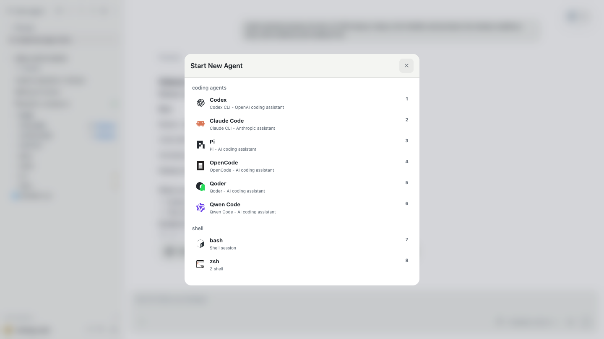
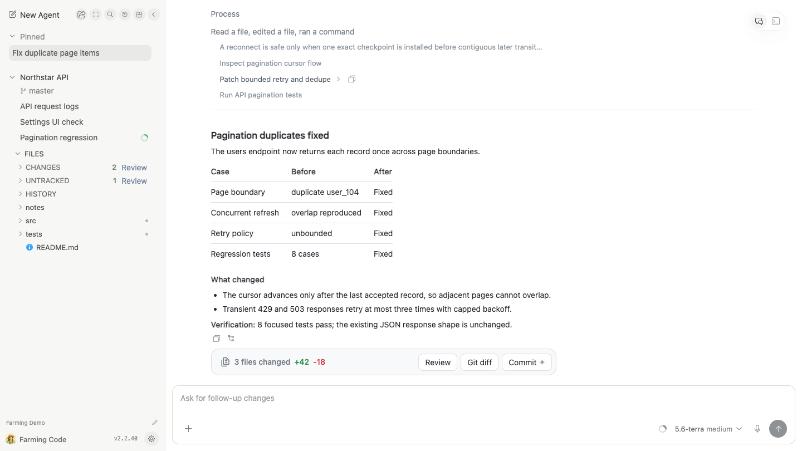
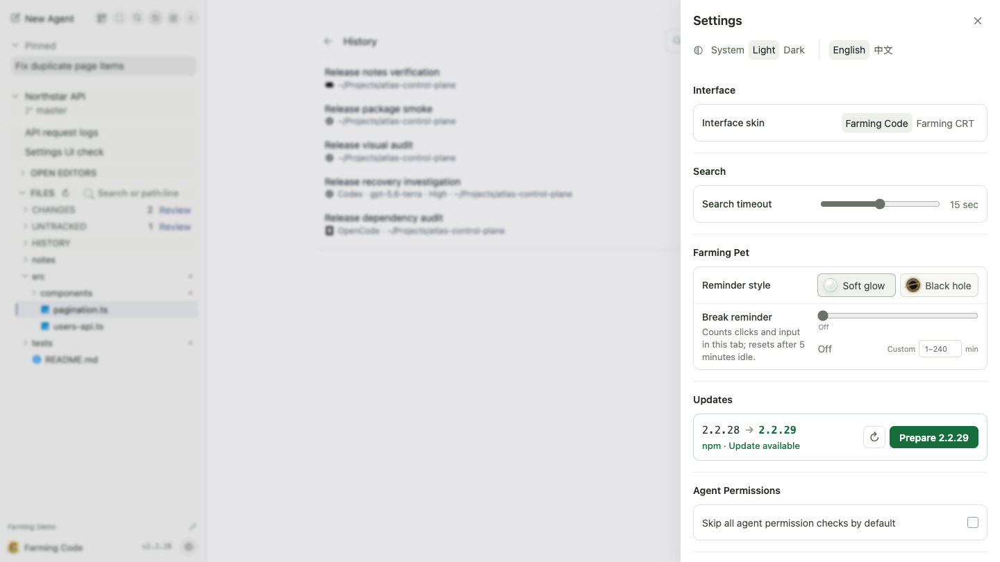

<p align="center">
  
</p>

<h1 align="center">Farming Code</h1>

<p align="center">
  Farming Code 是一个开源、自托管的浏览器工作区，用于启动和管理 Codex、Claude Code、OpenCode 及其他 AI Coding Agent。
</p>

<p align="center"><a href="./README.md">English</a></p>

<p align="center">
  <a href="https://github.com/zhuwenzhuang/farming/actions/workflows/ci.yml"></a>
  <a href="https://github.com/zhuwenzhuang/farming/releases"></a>
  <a href="https://www.npmjs.com/package/farming-code"></a>
  <a href="./LICENSE"></a>
  
  
</p>


Farming Code 与代码仓库和 Coding CLI 运行在同一台开发机上。Agent 进程、终端和项目文件都留在这台机器上；电脑或手机浏览器连接并操作这些真实 Session。

## 快速开始

准备好 Node.js 22.13 LTS（22.x）或 Node.js 24+，以及至少一个已安装、已登录的受支持 Coding CLI：

```bash
npm install --global farming-code@latest && farming daemon
```

打开命令输出的任意一个带鉴权 URL，选择 **New Agent**，再选择 CLI、Workspace 和 Chat 或 Terminal。关闭浏览器不会停止 Agent；同一个浏览器可以再次打开该地址。在开发机上，下面的命令会重新输出本机地址：

```bash
farming url
```

新的远程浏览器应使用 `farming daemon` 启动时输出的带鉴权 **Network** URL。VPN、SSH Tunnel 或 HTTPS Reverse Proxy 可以提供稳定且可达的地址，但第一次访问仍需要 Farming 启动 Token。



## Farming Code

Farming Code 是默认的桌面与手机界面。它按项目组织工作，把实时 Agent、可恢复的 History、文件、浏览器和 Review 放在同一个浏览器工作区里。

### Agent、Chat 与 Terminal

启动或恢复 Codex、Claude Code、OpenCode、Qoder 以及其他检测到的 Coding CLI。受支持的 Agent 提供结构化 Chat，用来阅读结果和检查工具活动；也可以打开真实 Terminal，直接操作 CLI。Search 和 History 同时覆盖当前工作与可恢复 Session。



### Files 与 Review

浏览、搜索并轻量编辑 Project Files，不需要离开当前任务。检查 Git Changes、History、Diff 和 Blame，再把 Commit 或 Working Copy 修改打开到 Review。

### Browser Resource

每个 Project 可以拥有多个可命名的 Browser Resource。用户在**插件 → 浏览器**中选择已发现的 Chromium 系统浏览器，或填写外部回环 CDP Endpoint。Farming 在安装或更新阶段准备锁定版本的 `agent-browser` Runtime，并在启动前再次校验 Cache，然后把人的输入和 Agent 操作发送给同一个 Session。Farming 不下载 Chromium，也不依赖 Playwright。Agent 先用 `farming capabilities` 发现实时能力，再通过渐进式披露的 `farming browser` CLI 使用导航、交互、检查、调试、页面状态、Frame/Dialog 与 Project 级文件传输；npm 安装还会提供 `farming-browser` 别名。详见 [Farming Browser Agent CLI](docs/products/code/browser-agent-cli.zh_cn.md)。

Farming 也可以连接由管理员独立管理的 Chromium CDP Endpoint，包括 Docker 中暴露的 Chromium；配置方式见[外部 CDP 浏览器指南](./docs/products/code/external-cdp-browser.zh_cn.md)。

第一版 Browser Viewer 面向网页展示与简单 Agent 操作，不替代浏览器完整窗口、DevTools、下载界面、浏览器扩展或 Computer Use。

## 支持的 Agent

Farming 在安装或更新阶段准备结构化 Runtime 所需的锁定版本 Codex 与 Claude Executable，并在启动前再次校验，同时继续发现开发机上安装的其他 CLI。Codex、Claude Code、OpenCode 和 Qoder 同时支持结构化 Chat 与原生 Terminal；其他检测到的 Coding Agent 使用 Terminal 路径。

| Agent | 结构化 Chat | Terminal | History / Resume |
| --- | --- | --- | --- |
| Codex | 是 | 是 | 是 |
| Claude Code | 是 | 是 | 是 |
| OpenCode | 是 | 是 | 是 |
| Qoder | 是 | 是 | 是 |
| bash / zsh | — | 是 | 否 |

Farming 承载的是已经能在同一台机器正常工作的 CLI，不替代 Provider 的安装、登录和账户配置。

## 远程使用

在开发机上运行 Farming，再从能够访问这台机器的电脑或手机打开带鉴权 URL：

```text
电脑或手机浏览器
       │ HTTP / WebSocket
       ▼
开发机
  Farming Server
  ├── Coding Agent 进程
  ├── 真实 Terminal
  ├── 代码仓库与项目文件
  └── 可选的系统浏览器进程
```

浏览器断开或重新连接不会停止 Agent。Farming Server 正常重启后也可以重新连接受支持的实时 Terminal Session。桌面布局把项目、对话、文件和 Review 放在一起；手机布局一次聚焦一段对话、一个 Terminal 或一个文件。

## Farming CRT

Farming CRT 是可选的键盘优先复古控制室，用来扫视多个 Agent、打开它们的 Chat 或 Terminal、搜索 History，以及查看用量遥测。


Code 与 CRT 使用相同的后端 Agent 和 Session，切换界面不会创建第二个 Agent。Farming Code 仍是默认界面，也是受支持的手机界面。控制方式和完整流程见 [Farming CRT 指南](./docs/products/crt/README.zh_cn.md)。

## Farming Net

Farming Net 是独立、带 Token 鉴权的 Farming 部署目录。它提供一个入口打开已登记实例，但不保存目标 Token，也不代理目标流量。登记方式和安全边界见 [Farming Net 指南](./docs/products/net/README.zh_cn.md)。

## 安装与更新

按上面的快速开始命令安装即可。对于 npm 安装，**Settings → Updates** 会在当前 Server 继续运行时准备所选版本，确认后再应用更新；原有启动 Token 保持不变。



独立 CLI 和目录 Bundle 仍可从 [GitHub Releases](https://github.com/zhuwenzhuang/farming/releases) 下载。

## 安全

Farming 会控制开发机上的真实终端和文件。请只运行在可信主机和可信网络中，不要在没有 VPN、SSH Tunnel、HTTPS Reverse Proxy 或等价访问控制时直接暴露到公网。

Token 鉴权同时保护 HTTP 和 WebSocket。`FARMING_DISABLE_AUTH=1` 只适合可信本地开发；Workspace 文件 API 会校验所有路径都位于所选项目根目录内。报告和部署说明见 [SECURITY.zh_cn.md](./SECURITY.zh_cn.md)。

## 文档

- [Farming 2 产品总览与能力矩阵](./docs/products/README.zh_cn.md)
- [Farming Code 指南](./docs/products/code/README.zh_cn.md)
- [Farming CRT 指南](./docs/products/crt/README.zh_cn.md)
- [Farming Net 部署门户](./docs/products/net/README.zh_cn.md)
- [移动端指南](./docs/products/code/mobile-guide.zh_cn.md)
- [ACP 运行时](./docs/products/code/acp-runtime.zh_cn.md)
- [Review 基础](./docs/products/code/review-foundation.zh_cn.md)
- [版本历史](https://github.com/zhuwenzhuang/farming/releases)
- [贡献者说明](./AGENTS.zh_cn.md)

## 开发检查

```bash
npm test
npm run typecheck
npm run lint
FARMING_BASE_PATH=/farming npm run build
npm run test:e2e:playwright
```

产品截图由匿名 Demo Workspace 和真实浏览器流程生成：

```bash
npm run docs:product:screenshots
```

只更新指定截图时，可以传入逗号分隔的文件名：

```bash
FARMING_SCREENSHOT_FILES=01-code-workspace.png npm run docs:product:screenshots
```

## License

Farming 使用 [MIT License](./LICENSE)。第三方组件声明见 [THIRD_PARTY_NOTICES.md](./THIRD_PARTY_NOTICES.md)。
