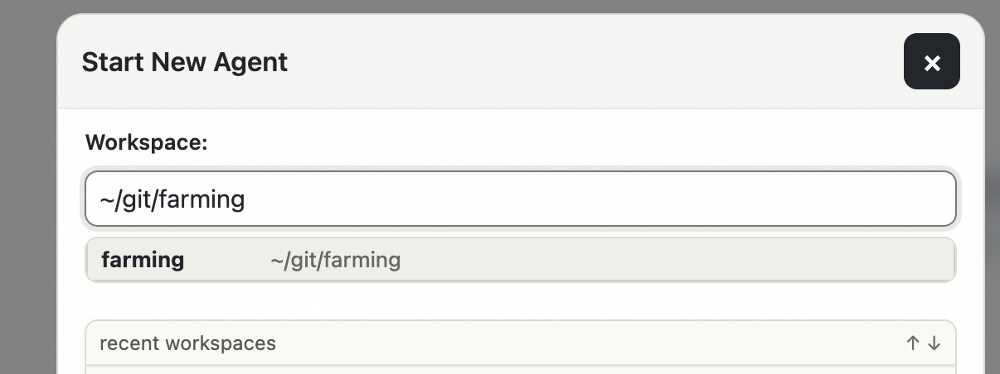
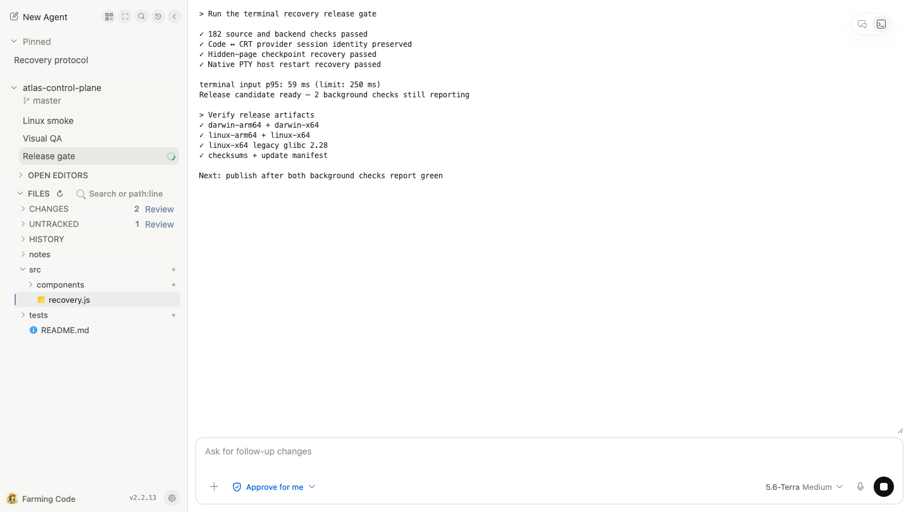
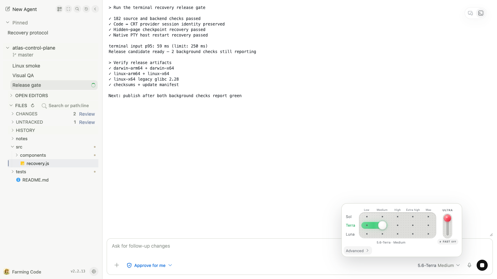
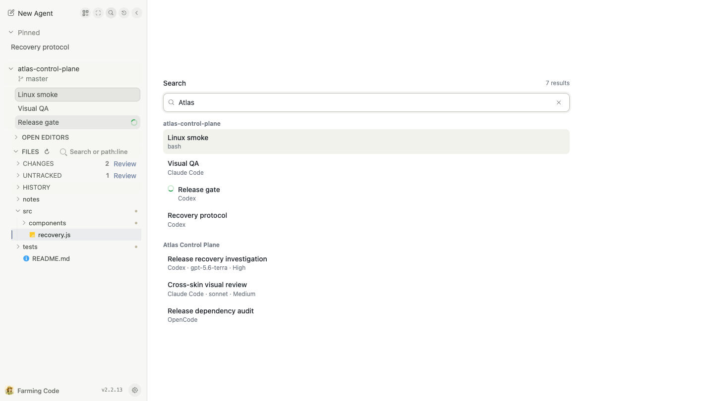

# Farming 2 产品总览

> English version: [README.md](./README.md)

Farming 2 是一个开源、可自定义的浏览器工作台，提供两套实时界面：Farming Code 用于聚焦编码和 Review，Farming CRT 用于键盘优先的监控与控制。两套界面共享同一批后端 Agent、Provider Session、原生 PTY 进程、History、Workspace Files 和设置。

如果有多套 Farming 部署，还可以用独立、带 Token 鉴权的 [Farming Net](net/README.zh_cn.md) 统一收录。完成登记的目标会接受绑定目标的短时签名通行证，同时不合并运行时，也不向门户暴露自己正常使用的 Token。

本文是当前公开能力的标准总览，会随着产品改进直接更新。历史变化保留在 [GitHub Releases](https://github.com/zhuwenzhuang/farming/releases) 中。

安装并启动：

```bash
npm install --global farming-code@latest && farming daemon
```

## 一分钟理解产品

1. 用电脑或手机打开带鉴权的浏览器 URL。
2. 在 Workspace 中启动 Agent，或者从 Search / History 恢复现有 Provider Session。
3. 需要可读过程时用结构化 Chat，需要精确 CLI 行为时用 Terminal。
4. 不离开当前 Agent 上下文，就能读文件、检查修改、做小范围编辑或进入 Review。
5. 离开页面，稍后再回来。Agent 仍在开发机上运行，实时终端可以重新连接。



## 根据当下任务选择界面

### Farming Code：理解并介入

Farming Code 让当前任务保持可读。最终回答在视觉上更突出，计划、推理、工具调用、权限请求、内嵌终端、子 Session 和精确 Patch 仍然按原始顺序可展开查看。


它适合长对话、Project Files、轻量编辑、Git 证据和工作区 Review 初版。桌面布局持续展示项目上下文；移动布局一次聚焦一个 Surface。

### Farming CRT：观察并控制

Farming CRT 把进行中的工作放在稳定的控制室机位中。它通过磷光风格控制台展示同一批结构化和终端 Session，并提供直接键盘导航、Search、History、Billing 遥测和显示控制。


当多个 Agent 同时运行、键盘控制比 Workspace 布局更快，或者终端输出和运行信号更重要时，适合使用 CRT。

## 能力矩阵

| 能力 | Farming Code | Farming CRT | 共享后端语义 |
| --- | --- | --- | --- |
| 实时 Agent 总览 | 项目分组、置顶、未读 | 稳定分页机位、实时 Preview | 同一份 Agent State 和 Attention Cursor |
| 结构化 Chat | ACP 注意力投影 | 有序磷光 Transcript 与 Composer | 同一条 ACP History / Live Entry Stream |
| Terminal | 完整 xterm Session 和 Composer 控制 | 全屏 xterm Session | 同一个原生 PTY 进程和 Screen Recovery |
| Chat / Terminal | Composer 中的运行时控制 | `MSG` / `TTY` 控制 | 重启实际运行时并安全恢复身份 |
| 模型与权限 | 实时模型矩阵、Advanced、Approval Mode | 结构化 Configuration Menu | 由 Provider Capability 驱动 |
| Project Files | Tree、Open Editors、搜索、Monaco、Preview、Diff、Blame | 通过共享链接打开引用文件 | Root Bounded Workspace API 和 Git Service |
| Review | 已跟踪/未跟踪工作区修改、已捕获 Revision 与评论初版 | 打开共享 Review Route | Snapshot Bound File 与 Reviewed State；多轮连续性仍在完善 |
| Search | 实时 Agent 和 Provider Archive | 带 Open / Resume 的 Query Console | 同一个有边界的 Provider Session Search |
| History | 可搜索 Run / Provider Archive | Continue / Restore / Resume 键盘列表 | Identity Dedup 和共享 Scope |
| Usage | 紧凑 Usage / Context / Quota 信号 | 按日历史和实时示波器 | Provider Local Telemetry，缺失时显式标记 |
| Mobile | 聚焦 Chat、Terminal、Files 与 Drawer | 当前未支持，请使用 Farming Code | 同一个带鉴权服务和 Session |
| 外观 | 浅色、深色 | CRT Effects、字号、Dynamic Heat | 切换界面不重启 Agent |

## 结构化工作，同时保留证据

Codex、Claude Code、OpenCode 和 Qoder 通过 ACP 使用结构化 Chat。Farming 不会在后端把 ACP History 重建成第二套 Conversation Model；History Replay 和 Live Event 会归并成同一条有序 Entry Stream。前端可以按人的注意力组织过程细节，但展开后仍恢复原始顺序和工具信息。


共享能力包括：

- 计划、推理、工具调用、权限、图片、文件和 Provider Command；
- Provider 支持时的内嵌 Terminal 与 Child Session；
- Turn 进行中可见的排队追问；
- 不发明第二套协议的 Interrupt 与 Permission Handling；
- 清理 Codex 内部 Context Envelope，同时保留用户可见的 Automation Notification。

## 一个 Session 既可以是 Chat，也可以是 Terminal

Terminal 是真实 PTY，不是给 Transcript 换皮。Chat / Terminal 切换会把 Agent 重启到 ACP 或原生 PTY 模式，并在 Provider Session 身份已经形成时恢复同一个 Session。

全新 Terminal 尚未接收用户输入时，即使 Provider History Record 还没出现，也可以直接进入新的 ACP Chat。一旦 Terminal 已有输入，Farming 不允许静默丢弃对话：History 缺失会成为可见错误，并恢复原来的运行时。




## 实时模型与权限控制

Farming 只渲染当前运行时支持的控制。兼容的 Codex Model Family 可以展示模型 Variant / Reasoning 的紧凑矩阵、独立 Ultra 充能控制、Fast 状态和 Approval Mode。不支持的 Fast 或 Ultra 不会让面板突然变形，而是保留位置、变灰并禁止操作。



**Advanced** 只改变选择方式，不重置当前 Profile。在原生 Terminal Session 中，新选择会在下一条用户消息之前发送给当前 CLI 工作流，因此它不是只影响以后启动的默认值。

## 围绕任务组织 Files 与 Review

Project Files 属于具体 Project Agent。侧栏提供 Lazy Tree、Open Editors、Path/Line 与内容搜索、Git Changes 和 Review；中央 Editor 提供带版本检查的 Monaco 编辑、Markdown / 图片 Preview、Diff 和 Blame。


Review 初版把已跟踪和未跟踪的工作区修改分开打开。它会捕获 Revision，展示 File / Diff，并把 Comment 与 Reviewed State 绑定到该 Snapshot，也可以比较后续修复。跨多轮持续跟踪同一组 Finding 和证据的体验仍在建设。


## Search 与 History

Search 覆盖当前 Project 和实时 Agent，以及可恢复的 Codex、Claude Code、OpenCode、Qoder Session。已经被 Live Agent 代表的结果会去重。History 合并 Farming Run Record、已归档的受支持 Coding Agent，以及尚未被占用的 Provider Session。




Shell 和未知命令不会变成可 Resume 的 Provider Session 或 Provider History Record；归档时对应进程会被销毁。

## 用量与运行感知

Farming Code 保持紧凑的用量信号。CRT Billing 把本地 Provider 数据扩展成两套运行视图：

- **Days**：120 天对数 Processed Token 历史、52 周 Activity、精确 Selected Day Total、小时 Total/Cache Curve 和 Provider Share。
- **Live**：60 分钟 Token Rate 示波器、5 分钟 Provider Channel、Quota Window 和 Reset Time。


这些是 Processed Token 遥测，不是账单。Cache Read 会包含在内。Provider 没有 Quota 或 Token Field 时会明确显示不可用，不会从 Terminal Output 中猜测。

## 桌面、手机与再次回来

浏览器只是控制面，不是进程 Owner。页面隐藏时会关闭 WebSocket 并停止重连，后端 Agent 和 PTY 继续运行；再次回来时只创建一个连接、恢复当前状态，并先同步 Focused Terminal，再继续增量输出。

Farming Code Mobile 强调一个可读任务 Surface 和 Drawer。Farming CRT 当前只支持桌面使用，手机请使用 Farming Code。

<p align="center">
  
</p>

## 运行时与数据边界

- Farming Server 负责鉴权、Agent Lifecycle、Session Routing、Files、History、Review、Usage 和配置。
- 独立 Native PTY Host 持有交互式终端进程，并且可以跨 Farming Server 重启存活。
- 浏览器只接收有边界的 API 和渲染所需 Session 数据；Repository 留在开发机上。
- Farming Session 元数据位于 `~/.farming/sessions/`，Run History 位于 `~/.farming/history/`。
- Codex、Claude、OpenCode 和 Qoder History 仍是外部只读来源。
- Agent 进程得到的是解析后的用户 Shell Environment 和白名单 Server Variable，而不是盲目复制整个 Server Environment。

## 继续阅读

- [Farming Code 产品指南](code/README.zh_cn.md)
- [Farming CRT 产品指南](crt/README.zh_cn.md)
- [Farming Net 部署门户](net/README.zh_cn.md)
- [移动端指南](code/mobile-guide.zh_cn.md)
- [ACP 运行时](code/acp-runtime.zh_cn.md)
- [Review 基础](code/review-foundation.zh_cn.md)
- [验收与 Dogfood 计划](code/test/acceptance-dogfood-plan.zh_cn.md)
- [仓库 README 与安装](../../README.zh_cn.md)
