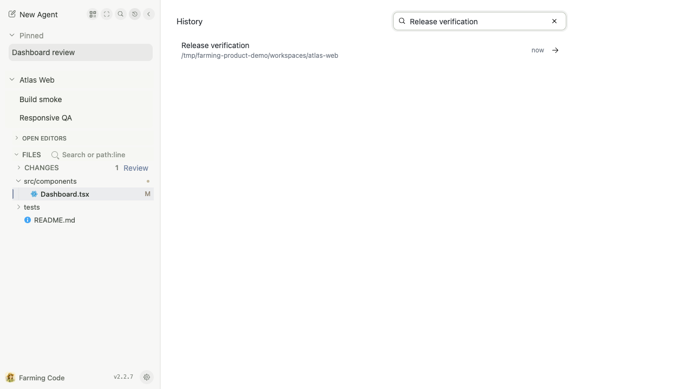
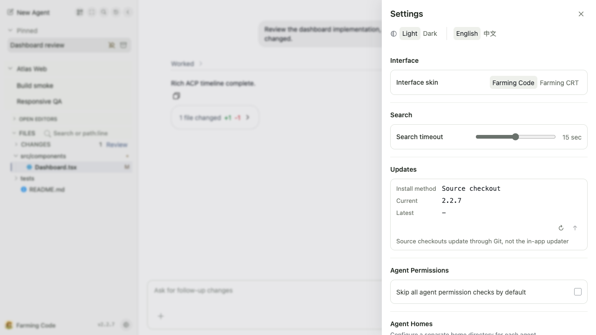
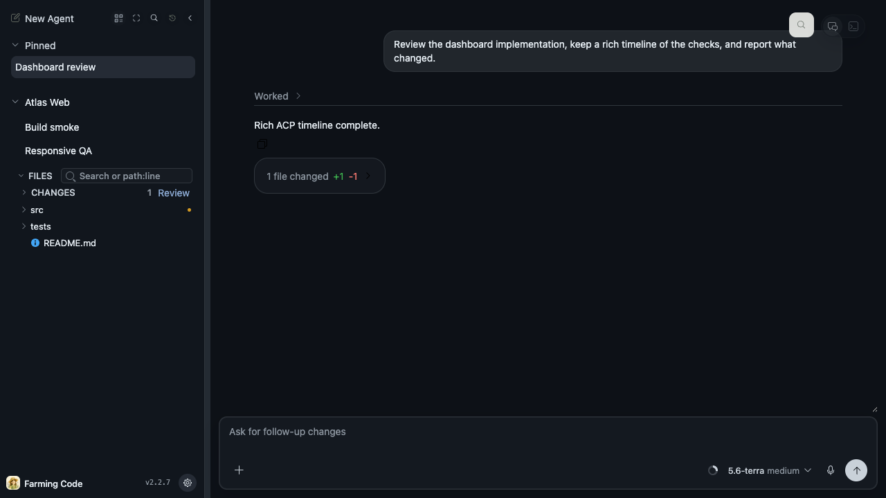

# Farming Code

> Chinese version: [README.zh_cn.md](./README.zh_cn.md)

Farming Code is the default Farming 2 interface: a browser workbench for supervising AI coding agents on a development machine. It keeps the conversation, live terminal, project files, search, history, review, and runtime controls around one evolving task instead of scattering them across SSH, an IDE, and several agent windows.


The normal shape is deliberately quiet: project-scoped Agents on the left, the current task in the center, relevant file state nearby, and a composer that continues the same provider session.

For the complete cross-interface capability map, see the [Farming 2 product overview](../README.md). This guide is updated in place so it always describes the current product rather than one release.

## Start A Real Task

Run `farming daemon` on a machine where at least one supported coding CLI already works, open its authenticated URL, and choose **New Agent**.


Farming detects available Agent executables instead of showing launch choices that cannot run. Select a recent or custom workspace, choose structured Chat or Terminal where both are supported, and start the task.


Codex, Claude Code, OpenCode, and Qoder provide both structured ACP Chat and native Terminal. Qwen Code, Aider, GitHub Copilot CLI, Amazon Q, bash, and zsh use the terminal path when detected. Farming hosts those CLIs; it does not replace their installation or login.

## Read The Result First, Expand The Process When Needed

ACP history replay and live updates become one ordered entry stream. Farming Code projects that stream around human attention: the result stays prominent, while plans, reasoning, tools, permissions, child sessions, embedded terminals, and exact patches remain expandable and reversible.


This is not a backend reconstruction into a different `Turn → Item` model. Expanding process groups preserves entry order and tool details. Codex internal heartbeat or context envelopes are sanitized without deleting visible automation notifications.

While a turn is active, a follow-up can be queued visibly and sent when the Agent becomes idle. It can be removed before sending. When the composer is empty, the same action remains available as interrupt.

## Use A Real Terminal When Exact CLI Behavior Matters

Terminal is a native PTY session rendered with xterm.js. ANSI output, full-screen TUIs, IME input, selection and copy, terminal search, scrollback, links, and CLI shortcuts stay on the terminal path.


The **Chat / Terminal** control changes the actual Agent runtime; it is not a view toggle. Farming restarts into ACP or PTY mode and resumes the same provider session when its identity exists. A fresh Terminal with no user input may move into a fresh Chat before the provider record has materialized. After Terminal input, missing resume identity is an explicit error so the conversation cannot be discarded silently.

The native PTY host is a separate process from the Farming server. Browsers can reconnect to live terminals, and a normal Farming server restart can recover them without launching duplicate Agents.

## Change The Live Model And Runtime Profile

The composer shows controls reported by the active runtime. Compatible Codex model families can expose one compact surface for model variant and reasoning, a separate Ultra charge control, a clear Fast state, and the current approval mode.


- Drag or click the continuous matrix to choose model variant and ordinary reasoning level.
- Click Ultra to trigger its charge-and-drop interaction; it is not a manually dragged vertical slider.
- Use Fast as a distinct speed choice rather than a second copy of the Ultra control.
- Unsupported Fast or Ultra remains in place, grey and disabled, so the control does not jump during capability refresh.
- **Advanced** morphs to step-by-step selectors without resetting the active profile.

Models that do not expose the matrix-capable catalog open directly in the Advanced compatibility selectors. Choosing a compatible model family from the live catalog returns to the matrix without requiring a restart.

ACP sessions apply supported changes directly. A compatible native Terminal stages the new model, reasoning, Fast, or permission information and sends it into the current CLI workflow before the next user message. The control therefore affects the live session, not only a future launch profile.

## Keep Project Files Beside The Agent

Files are scoped to a concrete project Agent. The project sidebar contains Open Editors, a lazy file tree, path/line and content search, Git Changes, and Review. Main Agent rows do not pretend to own project files.


The editor is a lightweight intervention surface:

- Monaco text editing with version checks;
- Markdown and image preview;
- file create, rename, move, and delete inside the workspace root;
- git status, diff, and blame;
- clickable `path:line` references from Chat and Terminal;
- bounded file watching and ripgrep search where available.

It is intentionally not a full IDE replacement. The goal is to verify evidence or make a focused correction without leaving the task.

## Review One Evolving Change

Review is revision-aware. It keeps a file list, immutable comparisons, patchsets, inline comments, findings, and reviewed state tied to the relevant snapshot rather than treating each Agent turn as an unrelated change.


This supports the real multi-round loop: review a change, ask for a correction, compare the new revision, and concentrate on meaningful deltas. Working-copy and historical ACP changes can both feed the Review surface when the required revision evidence exists.

## Find Live Work Or Resume Old Work

Search matches project names, Agent titles, and workspace paths across current live work.


History covers more than the left sidebar. It combines Farming run records, archived supported coding Agents, and unclaimed provider sessions from Codex, Claude Code, OpenCode, and Qoder, with identity-based deduplication.



Results preserve provider identity and workspace context. Depending on the record, the primary action can open, continue, restore, or resume. Shell processes are destroyed when archived and never masquerade as resumable provider sessions.

## Configure The Service Without Leaving The Workspace

Settings groups interface, language, search timeout, installation-aware updates, Agent permissions, and Agent Homes. Agent Homes let one Provider keep multiple identity/configuration roots while retaining a non-removable default home.



Switching to Farming CRT carries the focused Agent when possible and does not restart the session. npm installations can check and install updates in place; source checkouts update through Git, and standalone artifacts remain manual.

## Light, Dark, Desktop, And Mobile

Light and dark appearance changes the workbench without changing Agent processes or session identity.



On a phone, Farming Code focuses one conversation, terminal, or file at a time and moves project navigation into a drawer. It is intended for checking progress, switching Agents, reading a result, or sending a short intervention—not for squeezing a multi-pane desktop IDE onto a narrow screen.

<p align="center">
  
  &nbsp;&nbsp;
  
</p>

See the [mobile guide](mobile-guide.md) for the complete phone workflow.

## Farming Code And Farming CRT

The same service exposes:

- `<base-path>/code/`: Farming Code;
- `<base-path>/crt/`: Farming CRT;
- `<base-path>/`: compatible Farming Code entry.

Both interfaces connect to the same backend sessions. If Code cannot start or render, its bounded diagnostic overlay leaves the live CRT surface visible behind it. See the [Farming CRT guide](../crt/README.md) for dashboard, Search, History, Billing, and keyboard workflows.

## Install And Operate

The default installation requires Node.js 22 or newer:

```bash
npm install --global farming-code
farming daemon
```

Farming defaults to port `6694`, base path `/farming`, config directory `~/.farming`, and token authentication. Useful commands:

```bash
farming status
farming url
farming logs
farming stop
```

If an npm mirror still serves an older `latest`, compare it with the public registry, reinstall the current package, restart Farming, and hard-refresh the page:

```bash
npm view farming-code version --registry=https://registry.npmjs.org/
npm install --global farming-code@latest --registry=https://registry.npmjs.org/
farming stop
farming daemon
```

The browser controls real processes and workspace files on the Farming host. Use a trusted machine and trusted network, with VPN, SSH tunnel, HTTPS reverse proxy, or equivalent access control when remote access crosses an untrusted boundary. See [SECURITY.md](../../../SECURITY.md).

## More Product Documents

- [Farming 2 product overview](../README.md)
- [Mobile guide](mobile-guide.md)
- [ACP runtime](acp-runtime.md)
- [Review foundation](review-foundation.md)
- [Human-like acceptance story](farming-agent-human-story.md)
- [Acceptance and dogfood plan](test/acceptance-dogfood-plan.md)
