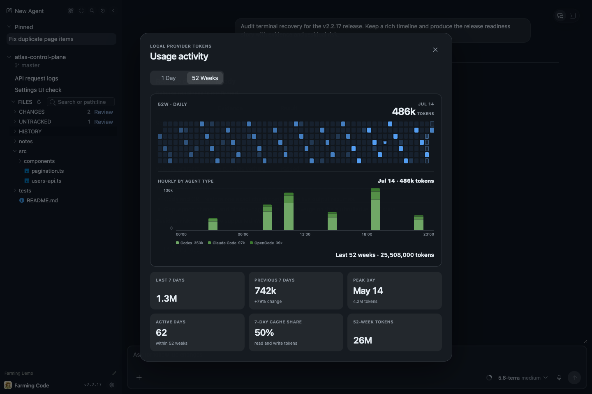

# Farming Code

> English version: [README.md](./README.md)

Farming Code 是 Farming 2 的默认界面：一个运行在开发机上的浏览器 AI Coding Agent 工作台。它把对话、实时终端、项目文件、Search、History、Review 和运行时控制围绕同一个演进中的任务组织起来，而不是散落在 SSH、IDE 和多个 Agent 窗口中。


正常界面刻意保持安静：左侧是按项目组织的 Agent，中间是当前任务，相关文件状态就在附近，底部 Composer 继续同一个 Provider Session。

同时管理多台 Farming 机器时，侧边栏会默认显示当前 Host 的 hostname，并把它用于浏览器页签标题。点击名称旁的铅笔图标可以设置一个易识别且会持久保存的实例名称；Farming Code 和 Farming CRT 会共用这个名称。

跨界面的完整能力矩阵见 [Farming 2 产品总览](../README.zh_cn.md)。本文会随产品改进直接更新，始终描述当前体验，而不是某一个版本。

## 切换到 Farming CRT

点击左下角齿轮，找到**界面**，选择 **Farming CRT**。Farming 会打开 `<base-path>/crt/`，并在条件允许时带上当前聚焦的 Agent。返回时，在 CRT 中按 `S`（或选择 **[S] SETTINGS**），再在 **UI Theme** 中选择 **Farming Code**。切换后仍是同一个实时 Agent 和 Provider Session，不会重启或复制进程。

## 启动一个真实任务

在至少一个受支持 Coding CLI 已经能正常工作的机器上，用一行命令安装并启动 Farming：

```bash
npm install --global farming-code@latest && farming daemon
```

打开带鉴权的 URL，然后选择 **New Agent**。


Farming 会发现实际可用的 Agent Executable，不展示无法启动的选项。选择最近使用或自定义 Workspace，在同时支持两种路径时选择结构化 Chat 或 Terminal，然后开始任务。Workspace 后面的目录按钮会打开由 Farming Host 提供数据的页面内目录浏览器，因此本地和远程页面都选择同一种服务端 Workspace 路径，不依赖桌面文件管理器。目录会在原位置按需逐步展开为树，选择深层 Workspace 时仍保留父级和兄弟目录上下文。

Codex、Claude Code、OpenCode 和 Qoder 同时提供结构化 ACP Chat 与原生 Terminal。Qwen Code、Aider、GitHub Copilot CLI、Amazon Q、bash 和 zsh 在检测到时使用 Terminal 路径。Farming 负责承载这些 CLI，不替代安装和登录。

## 先读结果，需要时再展开过程

ACP History Replay 与 Live Update 会形成同一条有序 Entry Stream。Farming Code 按人的注意力投影这条 Stream：结果保持突出，计划、推理、工具、权限、Child Session、内嵌 Terminal 和精确 Patch 仍然可以展开，并且可恢复原始顺序。首份稳定 Transcript 没有 Turn 时，Chat 会显示明确的空对话状态，而不是原因不明的白屏；同步中与失败仍分别显示自己的状态。


这不是在后端重建另一套 `Turn → Item` 模型。展开 Process Group 会保留 Entry 顺序与 Tool Detail。Codex 内部 Heartbeat / Context Envelope 会被清理，但用户可见的 Automation Notification 不会被删除。

Turn 运行中可以排队一条可见的 Follow-up，Agent 空闲后自动发送，也可以在发送前移除。Composer 为空时，同一个动作仍可用于 Interrupt。

## 需要精确 CLI 行为时使用真实 Terminal

Terminal 是由 xterm.js 渲染的原生 PTY Session。ANSI Output、全屏 TUI、IME 输入、选择复制、终端搜索、Scrollback、链接和 CLI Shortcut 都走真实终端路径。IME 组合输入会在原位置以下划线显示，不再浮出输入框式外观。


**Chat / Terminal** 会修改实际 Agent Runtime，不是视图切换。Farming 会重启到 ACP 或 PTY 模式，并在身份存在时恢复同一个 Provider Session。全新 Terminal 还没有用户输入时，即使 Provider Record 尚未形成，也可以进入新的 Chat；一旦 Terminal 已有输入，缺少 Resume Identity 就会显式报错，避免静默丢掉对话。

桌面端 Chat 与 Terminal 共用输入区边缘悬停出现的收起/恢复控件。Terminal 默认收起，并会在刷新后恢复用户上一次手动选择；手机端 Terminal 则默认保持 Composer 可见。收起只隐藏输入区，当前 Chat Transcript 或 Terminal 仍保持可见，尚未发送的草稿在恢复后继续保留。

Native PTY Host 与 Farming Server 是独立进程。浏览器可以重新连接到 Live Terminal，正常的 Farming Server 重启也可以恢复它们，而不会启动重复 Agent。

Terminal 恢复采用与 VS Code 持久终端相同的 checkpoint / replay 原则。PTY Host 中的 headless xterm 持续把输出归约为权威终端状态。每次 Runtime 有独立 epoch 和单调递增的输出索引；断线重连或页面恢复时只安装一次带精确索引的序列化 checkpoint，随后只接收连续增量。发现消息缺口或 Runtime epoch 变化时会重新获取 checkpoint，不会继续展示一个无法证明来源的混合状态。

关于 `/session-view`、多窗口控制、Flow Control 和恢复保证，请参阅 [Terminal 状态协议](terminal-state-protocol.zh_cn.md)。

## 切换 Agent 后继续阅读

阅读位置保存为带版本、与皮肤无关的浏览器锚点，而不是一个滚动条数值。Chat 保存稳定的 Turn（必要时细化到 Process Item）及其内部相对位置；Terminal 保存相邻逻辑行的指纹及该逻辑行内的行偏移；Monaco 保存 Workspace 内文件和首个可见行/列。

Code 与 CRT 使用同一份按浏览器 Tab 隔离的锚点协议。分享的 Agent URL 可以携带紧凑锚点，但不会暴露 Terminal 文本；接收端只在自己的实时 Transcript 或 Terminal 中解析它。解析绝不猜测：Chat Turn 或 Terminal 行指纹已经离开有界历史时，自动打开最新输出；文件行已不存在时，Editor 按普通打开行为处理。

## 修改运行中的模型与 Profile

Composer 只展示当前 Runtime 报告支持的控制。兼容的 Codex Model Family 可以显示模型 Variant / Reasoning 的紧凑 Surface、独立 Ultra 充能控制、清晰 Fast 状态和当前 Approval Mode。


- 在连续矩阵上拖动或点击，选择模型 Variant 和常规 Reasoning Level。
- 点击 Ultra 触发充能后自动下落的交互；它不是要手工上下拖的垂直 Slider。
- Fast 使用独立速度选择，而不是复制第二个 Ultra 控制。
- Fast / Ultra 不受支持时保留位置、变灰并禁止操作，Capability Refresh 时面板不会跳变。
- **Advanced** 会形变为逐级 Selector，但不会重置当前 Profile。

没有提供矩阵 Capability Catalog 的模型会直接打开 Advanced 兼容 Selector。从实时 Catalog 选择兼容模型家族后即可回到矩阵，不需要重启。

ACP Session 会直接应用受支持的修改。兼容 Native Terminal 会立即通过当前 CLI 工作流应用模型、Reasoning 或 Fast 修改，并在允许下一条 Composer 消息发送前确认底部状态。选择已有 Terminal 时，这个底部状态也是界面的真实来源，不会再被较新的启动默认值覆盖；没有经过验证的 Live Profile Adapter 的 Terminal Runtime 不展示当前 Session 模型选择器。所以它影响的是 Live Session，不只是未来 Launch Profile。

## 把 Project Files 放在 Agent 旁边

Files 绑定具体 Project Agent。项目侧栏包含 Open Editors、复用 VS Code 图算法的 Git History、Lazy File Tree、Path/Line 与内容搜索、Git Changes 和 Review。Main Agent Row 不会伪装成拥有 Project Files。

Agent Row 会逐级利用侧栏的可用宽度，同时保持紧凑行高：窄侧栏保留标题和必要状态；空间增加后补充 Provider 与相对活跃时间；宽侧栏再显示命令或 Runtime Profile 详情。标题由真实行宽决定截断位置，不再按固定字符数提前截断。

每个 Project 行的标题和操作按钮保持同一基线。眼睛按钮只隐藏或展示该 Project 的 Agent 列表，Files 仍可独立使用。`...` 菜单统一承载有序置顶、在 Finder 中显示、创建永久 worktree、重命名、全部标为已读、归档和移除操作。置顶 Project 按置顶顺序整体排在普通 Project 之前。


Editor 是轻量介入 Surface：

- 带版本检查的 Monaco 文本编辑；
- Markdown 与图片 Preview；
- Workspace Root 内的创建、重命名、移动和删除；
- 有边界的 Commit Graph、Branch/Tag、Merge Parent 选择、变更文件与 Commit Review；
- Git Status、Diff 和 Blame；
- 从 Chat / Terminal 点击 `path:line` 引用；
- 有边界的 File Watch，以及可用时的 ripgrep Search。

它不是完整 IDE 的替代品。目标是在不离开任务的情况下验证证据或做一个聚焦修正。

## Review 工作区修改

Review 初版把已跟踪与未跟踪的工作区修改分开。它会捕获 Revision，提供 File / Diff 视图，并把 Inline Comment 和 Reviewed State 绑定到相关 Snapshot，也可以比较后续修复。

只要 Revision 证据足够，Working Copy 和历史 ACP Change 都可以进入 Review Surface。跨多轮持续跟踪同一组 Finding 和证据，仍是正在完善的产品方向。

## 找到实时工作，或恢复旧工作

Search 会在当前 Live Work 中匹配项目名、Agent Title 和 Workspace Path。


History 不只覆盖左侧栏。它合并 Farming Run Record、已经归档的受支持 Coding Agent，以及尚未被 Live Agent 占用的 Codex、Claude Code、OpenCode、Qoder Provider Session，并按身份去重。

History 使用有边界的显式分页，不再持续拉长同一个滚动面。Search 和刷新会回到合法的第一页；只有翻到当前已加载边界时，才继续获取更早的 Provider Session 页。


结果保留 Provider Identity 和 Workspace Context。根据记录类型，主操作可以是 Open、Continue、Restore 或 Resume。Shell 进程归档时会被销毁，绝不会伪装成可以 Resume 的 Provider Session。

归档实时 Codex Agent 时，Farming 会先完成本地归档，再异步对稳定的 Provider Session 调用 `codex archive`。Provider 侧失败会由后端报告，但不会重新唤起已经终止的 Agent。

## 不离开 Workspace 就能配置服务

Settings 把 Interface、Language、Search Timeout、Installation Aware Update、Agent Permission 和 Agent Homes 放在一起。Agent Homes 允许同一个 Provider 使用多个 Identity / Configuration Root，同时保留一个不可删除的 Default Home。


切换到 Farming CRT 时会尽量携带当前 Focused Agent，不会重启 Session。npm 安装可以原地检查和安装更新；源码 Checkout 通过 Git 更新，Standalone Artifact 仍然手工替换。

## 理解本地 Token 用量

展开侧栏底部的 **Usage**，可以查看近期速率、每日历史，以及 Farming 能从本机读取的 Provider 信号。选择 1 Day 或 52 Weeks 图表后，会打开包含精确总量、按小时 Agent 类型归属、Cache 占比、活跃天数和峰值日的完整视图。



这些数字来自本地 Codex、Claude Code 历史以及 OpenCode Session Export 中的 Processed Token，包含 Cache Read，因此适合观察 Agent 活跃度，但不是账单，也不能直接等价为 API 成本。Farming 会在自身配置目录下为 Codex 和 Claude 历史维护增量 SQLite 派生缓存和持久化目录清单。首次有界构建完成后，未变化目录会直接复用；每次刷新只检查近期文件和固定大小的轮转审计批次，不会再枚举或 `stat` 每个 Session。Provider 或 Home 没有可读 Token 字段时会明确显示不可用。

## 浅色、深色、桌面与手机

浅色 / 深色只改变工作台外观，不会改变 Agent Process 或 Session Identity。


桌面 Chrome 可以把 Farming 安装成独立应用窗口，不再显示浏览器标签栏、地址栏、扩展或其他浏览器控制。浏览器提供安装入口时，点击 Share 旁边的应用 / 全屏按钮并选择“安装 Farming 2”；同一个弹窗保留全屏作为临时方案。安装不可用时，Farming 会说明原因，不再展示让用户手动寻找 Chrome 菜单的步骤；从已安装的 Farming 应用窗口打开时，这个入口不再显示。以后从 Farming 2 应用图标启动时，会打开干净的 Base Path URL 并复用已经建立的鉴权 Cookie；启动 Token 不会被固化在安装后的启动地址中。

手机端一次聚焦一个 Conversation、Terminal 或 File，并把项目导航移动到 Drawer。它适合检查进度、切换 Agent、阅读结果或发送短介入，而不是把多 Pane 桌面 IDE 硬塞进窄屏幕。

完整手机工作流见 [移动端指南](mobile-guide.zh_cn.md)。

## Farming Code 与 Farming CRT

同一个服务提供：

- `<base-path>/code/`：Farming Code；
- `<base-path>/crt/`：Farming CRT；
- `<base-path>/`：兼容的 Farming Code 入口。

两套界面连接同一批 Backend Session。如果 Code 无法启动或渲染，有限范围的诊断 Overlay 会保留后面的实时 CRT Surface。Dashboard、Search、History、Billing 和键盘流程见 [Farming CRT 指南](../crt/README.zh_cn.md)。

## 运行默认值与操作

默认运行环境要求 Node.js 22.13 LTS（22.x）或 Node.js 24+。

默认端口是 `6694`，Base Path 是 `/farming`，配置目录是 `~/.farming`，Token 鉴权默认开启。常用命令：

```bash
farming status
farming url
farming logs
farming stop
```

如果 npm Mirror 的 `latest` 仍然落后，可以与公共 Registry 对比，重新安装当前包、重启 Farming，并强制刷新页面：

```bash
npm view farming-code version --registry=https://registry.npmjs.org/
npm install --global farming-code@latest --registry=https://registry.npmjs.org/
farming stop
farming daemon
```

浏览器会控制 Farming Host 上的真实进程和 Workspace File。请使用可信机器和可信网络；跨越不可信边界时使用 VPN、SSH Tunnel、HTTPS Reverse Proxy 或等价访问控制。见 [SECURITY.md](../../../SECURITY.md)。

## 更多产品文档

- [Farming 2 产品总览](../README.zh_cn.md)
- [移动端指南](mobile-guide.zh_cn.md)
- [ACP 运行时](acp-runtime.zh_cn.md)
- [Review 基础](review-foundation.zh_cn.md)
- [增量正确性证明式 Review（产品方向）](incremental-review-proof.zh_cn.md)
- [拟人化验收故事](farming-agent-human-story.zh_cn.md)
- [验收与 Dogfood 计划](test/acceptance-dogfood-plan.zh_cn.md)
- [真实 Codex 跨皮肤发布验收 Case](real-codex-release-case.zh_cn.md)
