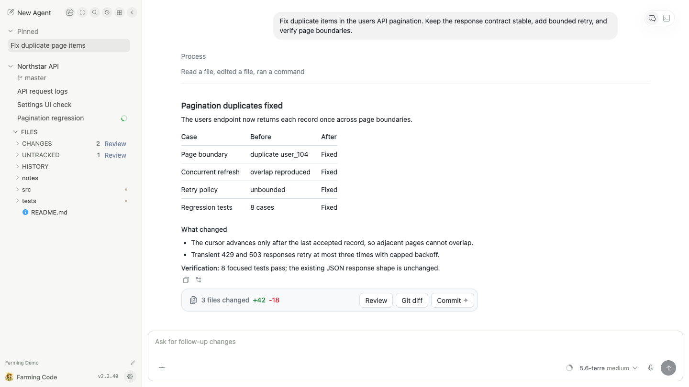

# Farming Code

> English version: [README.md](./README.md)

Farming Code 是默认的桌面与移动端工作区，用来跟进一个或多个 Coding Agent、阅读工作结果，并在需要时介入。

## 开始

安装 Farming，打开带鉴权 URL，然后选择 **New Agent**。首次使用流程见[快速开始](../../getting-started.zh_cn.md)。

## 主要工作流

### Agent、Chat 与 Terminal

在 Chat 中阅读结构化 Agent 结果，或在 Terminal 中直接使用 CLI。

### Files 与 Review

不离开当前任务，就能浏览 Project Files、检查修改、做小范围编辑并打开 Review。

### Search 与 History

查找进行中的工作，或恢复受支持的历史 Agent Session。

### Browser

人和 Agent 可以使用同一个 Project Browser。详见 [Farming Browser](browser-agent-cli.zh_cn.md)。

### Computer

Agent 可以操作一台隔离的 Linux 桌面，用户则在 Farming 中观察或显式接管。详见
[Farming Computer](computer-use.zh_cn.md)。

### 手机

在手机上打开 Farming 的带鉴权 URL。通过抽屉切换 Project 和 Agent；Chat、Terminal
与 Files 会分别使用完整屏幕。手机更适合查看进度和发送简短跟进。

### 正文字号

**设置 → 界面 → 正文字号**会调整 Chat 与输入框、Terminal、Markdown 预览，以及文件
编辑器和 Diff 中供用户阅读的内容。导航、按钮、状态标签等系统界面仍保持固定字号。
Farming Code 与 Farming CRT 分别保存自己的设置。

## 更多

- [Farming CRT](../crt/README.zh_cn.md)
- [文档首页](../../README.zh_cn.md)
