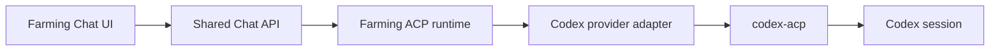

# Codex runtime modes

Chinese version: [codex-runtime.zh_cn.md](./codex-runtime.zh_cn.md)

Farming exposes two user-facing Codex surfaces:

- **Chat** uses `@agentclientprotocol/codex-acp`. This is the only supported structured Codex runtime.
- **Terminal** runs the Codex CLI in Farming's native PTY host.

The user chooses Chat or Terminal, never a transport implementation. Legacy JSONL remains a read-only compatibility source for older history. Farming no longer starts, connects to, or owns a Codex App Server.

## ACP boundary

The browser uses the same Chat contracts for every ACP provider. `AgentManager` delegates the session to `AcpRuntime`, while the Codex provider adapter supplies only Codex-specific executable discovery, environment, launch profile, and normalized capabilities.

The supported ACP surface includes:

- initialize, session creation, session load, prompt, and cancellation;
- ordered session updates and checkpoint-backed recovery;
- permission requests, elicitation, and authentication;
- tool-call details, diffs, patch decisions, and ACP terminals;
- text, image, and audio prompt parts;
- session modes and configuration options when the agent advertises them.

Capabilities come from ACP initialization and session metadata. The UI must disable or omit controls that the connected agent does not advertise. Codex-specific behavior must stay at the provider-adapter boundary rather than branching the generic lifecycle or Chat UI.

ACP has no standard live-steer operation. A message submitted while a turn is active is therefore an explicit queued follow-up in Farming, not an in-flight mutation of the active turn. Cancel remains the standard bounded way to stop an active prompt.

## Lifecycle and recovery

- An ACP Agent owns one adapter process and one ACP connection managed by `AcpRuntime`.
- The provider session id returned by ACP is the authoritative conversation id.
- Exact Farming reducer checkpoints may skip a full `session/load` only when their provider, Agent Home, session, workspace, and freshness fences still match.
- Missing, stale, corrupt, or dirty checkpoints stay on the visible bounded load/repair path.
- Killing or switching an Agent unregisters its ACP session and closes the owned adapter process.
- Persisted experimental `app-server` bindings are read as ACP bindings. Their Codex thread id is reused as the ACP session id when available; no App Server process is restarted.

Chat-to-Terminal and Terminal-to-Chat are real runtime restarts that preserve the same resumable provider session. A fresh Terminal may switch to Chat only before user input has materialized a provider conversation; otherwise Farming requires a verified resumable session.

## Verification

Changes to Codex Chat should cover:

1. deterministic ACP protocol tests for initialization, new/load, prompt, cancel, updates, permissions, elicitation, authentication, tools, terminals, configuration, and mixed prompt parts;
2. recovery tests for exact checkpoints, stale or dirty checkpoints, disconnects, and legacy App Server metadata migration;
3. browser tests for Chat/Terminal switching, transcript rendering, permission/input cards, attachments, queued follow-ups, cancellation, refresh, and reconnect;
4. a low-volume real Codex smoke through `codex-acp`, including text, image, mixed input, a queued follow-up, cancellation, and session resume.

The release gate remains `npm run test:pre-release:codex-ui`; it must exercise the supported ACP path rather than a private Codex transport.
