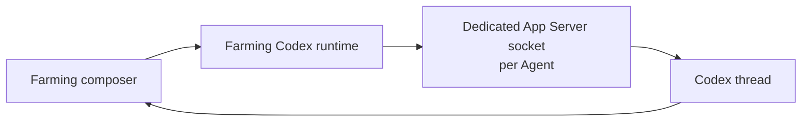

# Codex runtime modes

Chinese version: [codex-runtime.zh_cn.md](./codex-runtime.zh_cn.md)

Farming supports two runtime modes for newly started Codex agents:

- **CLI** (default): Farming starts Codex exactly as a terminal-owned CLI session. Composer messages are written to the terminal, preserving the stable legacy behavior.
- **Chat**: Farming gives each Codex Agent a dedicated Codex app-server. The Chat page sends and reads only the structured Codex protocol; it does not create a CLI or PTY observer. Its upstream protocol may change between Codex versions.

The **New Agent** dialog exposes only Chat or Terminal. Chat resolves to Codex App Server for Codex and ACP for other supported providers; the user never chooses a transport. The persisted `codexRuntimeMode` remains compatibility metadata for old sessions only.

The browser sends every structured Chat submission through one `composer-input` contract. `AgentManager.sendComposerMessage` dispatches by the authoritative runtime binding: Codex uses App Server `turn/start` or `turn/steer`; ACP providers use `session/prompt`. Provider capabilities expose the difference explicitly: only the Codex binding advertises `supportsSteer`.

For Codex Chat, each composer submission has a client request id. Farming keeps the draft until the managed App Server accepts the exact `turn/start` or `turn/steer`; a rejected or disconnected request leaves the draft available rather than treating WebSocket enqueue as delivery.

## Separate runtime boundaries

Codex CLI itself uses an app-server client. On a local machine it discovers the default Unix control socket below the active `CODEX_HOME`:

```text
CODEX_HOME/app-server-control/app-server-control.sock
```

In App Server mode, Farming creates a short, dedicated runtime `CODEX_HOME` for each Agent. It links the selected Agent Home’s identity/configuration entries while keeping the control socket, sessions, and logs private to that Agent. Farming starts `codex app-server --listen unix://` in that runtime home and creates or resumes the thread through JSON-RPC. The Chat page is built from `thread/read` plus App Server notifications, not terminal output or rollout JSONL.



## Lifecycle and recovery

- Each App Server Agent owns one dedicated runtime home and one dedicated app-server process. Farming never reuses an external Codex Desktop or standalone CLI socket.
- The configured Agent Home remains the selected identity/configuration source; the runtime home keeps generated socket/session/log state separate and uses a short path that fits Unix socket limits.
- Farming starts `codex app-server --listen unix://` with the Agent’s dedicated runtime environment and waits for its `initialize` response.
- Farming records the selected runtime mode, runtime-home path, app-server state, thread id, and current turn id in live and persisted Agent metadata. The provider session id is the Codex thread id in App Server mode.
- If a persisted App Server thread can no longer be recovered, Chat shows an explicit unavailable state instead of an empty pane. Switching that Agent to Terminal performs a real CLI restart even though its legacy `agentRuntimeMode` metadata may already say `terminal`.
- Killing an Agent terminates its dedicated app-server process. Farming server restart preserves a healthy dedicated server so the recovered Agent can reconnect.

The native PTY host owns CLI mode only. App Server mode is independent of PTY lifecycle, terminal output, terminal focus, and rollout JSONL polling.

## Input, turns, and controls

In App Server mode:

- an idle composer submission calls `turn/start`;
- a submission while the same thread is active calls `turn/steer` with the active turn id;
- pasted or selected images and audio use the same Composer attachment contract as ACP and are sent as App Server `localImage` and `localAudio` inputs; text files remain explicit text in the message;
- the interrupt control calls `turn/interrupt` through the App Server connection and reports an App Server error if that control is unavailable;
- changing an App Server Agent's permission profile calls `thread/settings/update` on that same thread. It keeps the Agent and thread in place; the updated approval and sandbox policy applies to subsequent turns without starting a CLI or PTY;
- command/file approvals and structured user-input requests remain structured runtime events above the Composer and are answered with their original JSON-RPC request id. Farming must not auto-approve them; unsupported reverse requests remain explicit and can be declined rather than silently leaving a turn blocked.

App Server Chat has no browser terminal surface. Its transcript is a structured App Server read model. CLI mode has the existing terminal UI and sends/reads only through its PTY.

## Compatibility and failure behavior

App Server mode requires a Codex CLI with the app-server protocol available. If Farming cannot create its dedicated runtime home, start, connect, initialize, create, or resume a thread, Agent creation fails with a clear App Server error. It never silently changes the Agent to CLI mode.

The external `/api/app-server` bridge remains available for diagnostics and integrations. It is not the lifecycle owner for Farming-managed agents, and it never stores third-party endpoint credentials in Farming settings.

## Verification

Runtime changes require both deterministic and real checks:

1. A deterministic mock app-server connection verifies App Server mode: dedicated-home startup decisions, thread creation/resume, structured transcript events, composer `turn/start`, follow-up `turn/steer`, interruption, and reverse request resolution without creating a CLI observer.
2. A CLI-mode regression verifies that neither the app-server process nor structured RPC is requested and composer text reaches the terminal unchanged.
3. A low-volume local Codex smoke verifies `initialize` plus thread start/resume against the installed CLI, using an isolated disposable workspace.
4. The browser check verifies the Chat/Terminal selection, the unchanged terminal focus after a runtime switch, and the App Server runtime indicator while a request is in progress.

Run the opt-in real smoke locally with `npm run test:codex-app-server:real`. It sends one small prompt to the installed, authenticated Codex CLI; it is intentionally excluded from normal tests and release CI.
