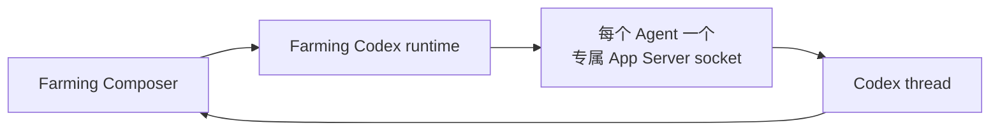

# Codex 运行时模式

English version: [codex-runtime.md](./codex-runtime.md)

Farming 为**新启动的** Codex Agent 提供两种运行时模式：

- **CLI**（默认）：Farming 按原来的终端拥有方式启动 Codex；Composer 直接向终端写入消息，作为稳定路径。
- **Chat**：Farming 为每个 Codex Agent 持有专属的 Codex app-server；Chat 页面只通过结构化 Codex 协议读写，不创建 CLI 或 PTY observer。其上游协议可能随 Codex 版本变化。

**New Agent** 对话框只显示 Chat 或 Terminal。Chat 对 Codex 固定解析为 App Server，对其他支持的 provider 固定解析为 ACP；用户不会选择传输方式。持久化的 `codexRuntimeMode` 只为旧 session 兼容保留。

浏览器的所有结构化 Chat 提交都使用同一个 `composer-input` 契约。`AgentManager.sendComposerMessage` 根据权威的 runtime binding 分发：Codex 调用 App Server 的 `turn/start` 或 `turn/steer`，ACP provider 调用 `session/prompt`。能力差异会明确暴露：只有 Codex binding 标记 `supportsSteer`。

Codex Chat 的每次 Composer 提交都有客户端 request id。Farming 会保留草稿，直到受管 App Server 接受对应的 `turn/start` 或 `turn/steer`；请求被拒绝或连接断开时，不能把 WebSocket 入队误当成已送达，草稿仍可继续编辑或重试。

## 两条运行时边界

Codex CLI 自己也使用 app-server client。本机运行时，它会在当前 `CODEX_HOME` 下发现默认的 Unix 控制 socket：

```text
CODEX_HOME/app-server-control/app-server-control.sock
```

App Server 模式中，Farming 会为每个 Agent 创建一个短路径、专属的 runtime `CODEX_HOME`：它链接所选 Agent Home 的身份/配置条目，但控制 socket、session 和日志只属于该 Agent。Farming 在该 runtime home 中启动 `codex app-server --listen unix://`，通过 JSON-RPC 创建或恢复 thread。Chat 页面由 `thread/read` 快照和 App Server notification 构建，不读取 terminal 输出或 rollout JSONL。



## 生命周期与恢复

- 每个 App Server Agent 有独立 runtime home 和独立 app-server 进程；Farming 不会复用 Codex Desktop 或独立 CLI 的外部 socket。
- 配置中的 Agent Home 仍是身份/配置来源；runtime home 只隔离生成的 socket、session、日志，并保持短路径以满足 Unix socket 长度上限。
- Farming 使用 Agent 的专属 runtime 环境启动 `codex app-server --listen unix://`，并等待 `initialize` 成功。
- Farming 在 live 和持久化 Agent 元数据中保存运行时模式、runtime home、app-server 状态、thread id 和当前 turn id。App Server 模式下 provider session id 就是 Codex thread id。
- 如果持久化的 App Server thread 已无法恢复，Chat 会明确显示不可用状态，不再留下空白区域。把该 Agent 切换到 Terminal 时会真正重启为 CLI，即使旧元数据中的 `agentRuntimeMode` 已经是 `terminal`。
- 结束一个 Agent 会结束专属 app-server。Farming 服务重启保留健康的专属服务，供恢复后的 Agent 重新连接。

Native PTY host 只负责 CLI 模式。App Server 模式独立于 PTY 生命周期、terminal 输出、terminal 焦点和 rollout JSONL 轮询。

## 输入、turn 与控制

App Server 模式中：

- 空闲时 Composer 提交调用 `turn/start`；
- 同一 thread 已在执行时，提交调用带当前 turn id 的 `turn/steer`；
- 粘贴或选择的图片和音频与 ACP 共用同一 Composer 附件契约，并作为 App Server `localImage` 和 `localAudio` 输入发送；文本文件继续以内联文本发送；
- 中断按钮通过 App Server 连接调用 `turn/interrupt`；如果该控制不可用，就显示 App Server 错误；
- 切换 App Server Agent 的权限 profile 会直接对同一个 thread 调用 `thread/settings/update`，保留原 Agent 和 thread，不会启动 CLI 或 PTY；更新后的审批和 sandbox 策略从后续 turn 生效；
- Codex 发来的命令/文件审批和结构化用户输入会显示在 Composer 上方，并按原始 JSON-RPC request id 回答；Farming 不会自动批准。暂不支持的反向请求会明确提示并允许拒绝，不会悄悄把 turn 卡住。

App Server Chat 没有浏览器终端界面；它的 transcript 是结构化的 App Server read model。CLI 模式继续使用既有 terminal UI，并且只通过 PTY 读写。

## 兼容性与失败行为

App Server 模式需要安装的 Codex CLI 支持 app-server 协议。如果 Farming 无法创建专属 runtime home、启动、连接、初始化、创建或恢复 thread，Agent 创建会明确失败并显示 App Server 错误；绝不会静默改成 CLI 模式。

现有的外部 `/api/app-server` bridge 仍用于诊断和集成，不是 Farming 托管 Agent 的生命周期 owner，并且不会把第三方 endpoint 凭据写入 Farming 设置。

## 验证

运行时改动至少需要四类验证：

1. 用确定性的 mock app-server connection 验证 App Server 模式：专属 home 启动决策、创建/恢复 thread、结构化 transcript 事件、Composer `turn/start`、追问 `turn/steer`、中断、反向请求响应，并验证不会创建 CLI observer。
2. 用 CLI 模式回归验证：不启动 app server、不调用结构化 RPC，Composer 文本仍原样写进 terminal。
3. 用低频真实 Codex 本机 smoke，在隔离临时 workspace 里验证已安装 CLI 的 `initialize` 与 thread start/resume。
4. 浏览器验证 Chat/Terminal 选择、切换后当前终端焦点不变，以及请求进行中 App Server runtime 状态。

本机可用 `npm run test:codex-app-server:real` 运行显式真实 smoke。它会向已安装且已登录的 Codex CLI 发送一条很小的 prompt，因此刻意不进入普通测试或发布 CI。
