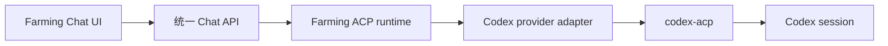

# Codex 运行时模式

English version: [codex-runtime.md](./codex-runtime.md)

Farming 对用户提供两种 Codex 形态：

- **Chat** 使用 `@agentclientprotocol/codex-acp`，这是唯一受支持的 Codex 结构化运行时。
- **Terminal** 在 Farming 的 native PTY host 中运行 Codex CLI。

用户只选择 Chat 或 Terminal，不选择底层传输实现。旧 JSONL 仅作为历史兼容读取来源。Farming 不再启动、连接或管理 Codex App Server。

## ACP 边界

浏览器对所有 ACP provider 使用同一套 Chat 契约。`AgentManager` 把 session 委托给 `AcpRuntime`；Codex provider adapter 只提供 Codex 特有的可执行文件发现、环境、启动 profile 和归一化能力。

受支持的标准 ACP 能力包括：

- initialize、创建 session、加载 session、prompt 与 cancel；
- 有序 session update 和基于 checkpoint 的恢复；
- permission request、elicitation 与 authentication；
- tool detail、diff、patch decision 和 ACP terminal；
- 文本、图片和音频 prompt part；
- agent 声明支持时的 session mode 与 config option。

能力以 ACP initialize 与 session metadata 为准。连接的 agent 未声明某项能力时，UI 必须禁用或隐藏相应控制。Codex 差异应停留在 provider adapter 边界，不能分叉通用生命周期或 Chat UI。

ACP 标准没有 live steer 操作。因此 turn 活跃时提交的新消息在 Farming 中是明确的排队追问，不会修改正在执行的 turn。停止当前 prompt 使用标准 cancel。

## 生命周期与恢复

- 每个 ACP Agent 有一个由 `AcpRuntime` 管理的 adapter 进程和 ACP 连接。
- ACP 返回的 provider session id 是权威会话 id。
- 只有 provider、Agent Home、session、workspace 和 freshness fence 全部匹配时，精确 Farming reducer checkpoint 才可跳过完整 `session/load`。
- checkpoint 缺失、过期、损坏或 dirty 时，必须进入可见且有界的 load/repair 路径。
- 结束或切换 Agent 时，注销 ACP session 并关闭所拥有的 adapter 进程。
- 旧的实验性 `app-server` binding 在读取时迁移为 ACP binding；存在 Codex thread id 时将其复用为 ACP session id，但不会重启 App Server。

Chat 与 Terminal 的切换是真实运行时重启，并保留同一个可恢复 provider session。全新 Terminal 只有在用户尚未输入、provider conversation 尚未物化时才能直接切到 Chat；其他情况必须先验证 session 可恢复。

## 验证

Codex Chat 改动需要覆盖：

1. 确定性 ACP 协议测试：initialize、new/load、prompt、cancel、update、permission、elicitation、authentication、tool、terminal、config 和混合 prompt part；
2. 恢复测试：精确 checkpoint、stale/dirty checkpoint、断线，以及旧 App Server 元数据迁移；
3. 浏览器测试：Chat/Terminal 切换、transcript、权限/输入卡片、附件、排队追问、cancel、刷新与重连；
4. 通过 `codex-acp` 的低频真实 Codex smoke：文本、图片、混合输入、排队追问、cancel 和 session resume。

发布门禁仍为 `npm run test:pre-release:codex-ui`，但它必须覆盖受支持的 ACP 路径，而不是私有 Codex transport。
