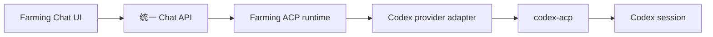

# Codex 运行时模式

English version: [codex-runtime.md](./codex-runtime.md)

Farming 对用户提供两种 Codex 形态：

- **Chat** 使用 `@agentclientprotocol/codex-acp`，这是唯一受支持的 Codex 结构化运行时。
- **Terminal** 在 Farming 的 native PTY host 中运行 Codex CLI。

用户只选择 Chat 或 Terminal，不选择底层传输实现。旧 JSONL 仅作为历史兼容读取来源。Farming 不再启动、连接或管理 Codex App Server。

## Executable 所有权与版本策略

Terminal 与 ACP 是两条相互独立的 Executable 所有权边界：

- Native Codex Terminal 优先使用用户的系统 Codex Executable。只有在
  Farming 自有 Executable 的已验证版本严格高于系统候选版本时，才选择自有
  版本；版本相等时使用系统版本；系统版本不存在时才使用 Farming 自有版本。
  Terminal 启动不得在用户系统版本已经可用时，因较低的 Farming 副本而提示用户
  升级。
- Codex ACP 始终使用 Farming 自有且锁定版本的 Adapter 与 Codex Runtime，
  独立于 Terminal 的 Executable 选择结果。ACP Runtime 不得因为 Server 环境中
  存在系统路径，就继承 Terminal 的系统 Executable。
- ACP Pin 应尽量跟随最新的兼容 Provider Release。更新 Pin 必须通过已审阅的
  Adapter Patch/Integrity 校验，以及 Chat/Terminal 切换、Resume 和真实 Provider
  Smoke；协议兼容性优先于盲目跟随 registry 的 `latest` Tag。

## ACP 边界

浏览器对所有 ACP provider 使用同一套 Chat 契约。`AgentManager` 把 session 委托给 `AcpRuntime`；Codex provider adapter 只提供 Codex 特有的可执行文件发现、环境、启动 profile 和归一化能力。

```mermaid
flowchart LR
  Browser["Farming Chat UI"] --> API["统一 Chat API"]
  API --> ACP["Farming ACP runtime"]
  ACP --> Adapter["Codex provider adapter"]
  Adapter --> CodexACP["codex-acp"]
  CodexACP --> Codex["Codex session"]
```

受支持的标准 ACP 能力包括：

- initialize、创建 session、加载 session、prompt 与 cancel；
- 有序 session update 和基于 checkpoint 的恢复；
- permission request、elicitation 与 authentication；
- tool detail、diff、patch decision 和 ACP terminal；
- 文本、图片和音频 prompt part；

当 Codex 通过 `custom_tool_call_output` 发出图片（例如 `view_image` 返回的截图）时，Farming 会将其直接展示在 Agent 答复区域，而不是只收在折叠的 Tool 记录中；Tool 的文本详情仍保留在 Process 里。
- 通过可协商、带版本的 adapter 扩展对活跃 Codex turn 执行实时 steer；
- agent 声明支持时的 session mode 与 config option。

能力以 ACP initialize 与 session metadata 为准。连接的 agent 未声明某项能力时，UI 必须禁用或隐藏相应控制。Codex 差异应停留在 provider adapter 边界，不能分叉通用生命周期或 Chat UI。

ACP 标准没有 live steer 操作。因此 Farming 锁定的 Codex adapter 会声明带版本的 `_codex/session/steer` 扩展，并携带活跃 turn id 转发到 Codex App Server `turn/steer`。统一 Chat 后端只在实时 adapter 明确声明该能力时使用它；其他 ACP provider 仍保留明确的排队追问行为，停止当前 prompt 继续使用标准 cancel。

## 生命周期与恢复

- 每个 ACP Agent 有一个由 `AcpRuntime` 管理的 adapter 进程和 ACP 连接。
- ACP 返回的 provider session id 是权威会话 id。
- 只有 provider、Agent Home、session、workspace 和 freshness fence 全部匹配时，精确 Farming reducer checkpoint 才可跳过完整 `session/load`。
- checkpoint 缺失、过期、损坏或 dirty 时，必须进入可见且有界的 load/repair 路径。
- 结束或切换 Agent 时，注销 ACP session 并关闭所拥有的 adapter 进程。

Chat 与 Terminal 的切换是真实运行时重启，并保留同一个可恢复 provider session。全新 Terminal 只有在用户尚未输入、provider conversation 尚未物化时才能直接切到 Chat；其他情况必须先验证 session 可恢复。

对于全新的 Codex Terminal，Farming 从结构化 `/status` 面板中物化可恢复
Session 身份。装饰性边框和布局变化不得让有效的 Provider Session 退回未经验证的
临时身份。

Codex Terminal 的模型 Profile 控件以 Backend Provider Adapter 精确声明的能力为准。瞬时的启发式 Terminal Screen Observation 可以更新忙闲和生命周期状态，但 Codex 重绘 Composer 时不得因此隐藏已经声明的模型控件。

## 验证

Codex Chat 改动需要覆盖：

1. 确定性 ACP 协议测试：initialize、new/load、prompt、cancel、update、permission、elicitation、authentication、tool、terminal、config 和混合 prompt part；
2. 恢复测试：精确 checkpoint、stale/dirty checkpoint 与断线；
3. 浏览器测试：Chat/Terminal 切换、transcript、权限/输入卡片、附件、协商后的 Codex steer、非 Codex 排队追问、cancel、刷新与重连；
4. 通过 `codex-acp` 的低频真实 Codex smoke：文本、图片、混合输入 steer、turn 结束竞态、cancel 和 session resume。

发布门禁仍为 `npm run test:pre-release:codex-ui`，但它必须覆盖受支持的 ACP 路径，而不是私有 Codex transport。
