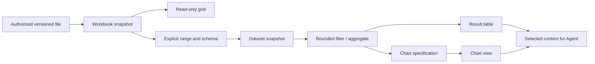

# Tabular Data And Visualization Proposal

> Chinese version: [tabular-data-visualization-design.zh_cn.md](./tabular-data-visualization-design.zh_cn.md)

Status: phase 1 complete, updated 2026-09-19. The read-only viewer and representative three-sheet, 12,000-row acceptance are complete; numeric performance budgets and phases 2–4 remain open.

## Product Outcome

Users should open an Agent-produced workbook, inspect its values, select a useful range, visualize it, and ask the Agent a follow-up that retains the source location. Files, Chat, and analysis views should compose inside the existing workspace.

The first release provides read-only XLSX and CSV/TSV inspection. Subsequent releases add typed datasets, a small chart vocabulary, and saved analysis views. Spreadsheet editing, formula recalculation, and arbitrary database connections are separate scope decisions.

## Current Implementation

XLSX, CSV, and TSV files open in the existing versioned file tab. Parsing runs in a cancellable browser Worker using pinned SheetJS CE 0.20.3; VTable 1.26.8 is loaded only when a spreadsheet is opened. Navigation, find, copy and quote controls become available only after the table renderer is ready. Copy and quotes use the same displayed selection snapshot. The viewer provides sheet switching, find, address navigation, range selection and copy, source-attributed Chat quotes, merged cells, original coordinates, formatted cached values, formula inspection, and explicit missing-cache and hidden-content notices.

The backend admits files through the existing 8 MiB preview limit and additionally bounds XLSX ZIP entry count, individual expanded entries, and total expanded bytes before transfer. The Worker independently bounds rows, columns, retained cell area, text length, and parse time. Dataset conversion, charts, saved analysis views, are not implemented yet. Bounded selected-cell quotations into an existing Chat draft are supported.

## Existing Foundation And Reference Lessons

- Farming already owns workspace authorization, exact file watches, versioned file models, editor tabs, and binary transport. The phase 1 viewer reuses those paths and adds bounded spreadsheet parsing and rendering without another workspace access system.
- Farming already adapts Codex visualization references into HTML resources and renders them in a sandboxed Chat iframe. This path is provider-specific at admission today. Ordinary HTML file previews disable scripts. The specialized visualization policy permits selected external script CDNs, so it does not establish offline availability.
- Open WebUI reads workbooks with SheetJS, switches sheets, and generates a sanitized HTML table. Its inspected renderer materializes every row and column, which is unsuitable as Farming's large-table architecture. It also recognizes Vega/Vega-Lite code blocks.
- Craft Agents separates file-backed structured data from compact Chat table/spreadsheet blocks, with expansion and export. Its inspected spreadsheet block is JSON rendered as an HTML table, not an XLSX importer or a virtualized workbook engine. Reuse the interaction idea, not its assumptions about currency, precision, or data size.
- OpenAI's current desktop documentation describes spreadsheet/document previews alongside Chat, annotations, and interactive HTML previews. Its visualization documentation emphasizes interactive explanations and snapshot results. These are useful product patterns; they do not establish which libraries the desktop uses or that every account has the same capabilities.
- MCP Apps demonstrates a host/view boundary and explicit messaging for embedded tools. Use this as a reference for future external interactive resources; basic local file viewing does not require an MCP Apps integration.

## Library Decision

Fully open-source implementation is a hard selection constraint. Every adopted component and required capability must be available under an open-source license compatible with Farming, support self-hosted/offline operation, and require no commercial license, proprietary conversion service, license key, or paid feature unlock. This applies to the planned selection/copy, import/export, charting, and exploration workflow, not just the initial viewer. Source-available or free-to-use proprietary software does not qualify. Optional commercial offerings do not disqualify an independently usable open-source edition, but no planned capability may depend on them.

AG Grid is excluded from the candidate and comparison list because the required range-selection and built-in clipboard capabilities are commercial features. Any spreadsheet route requiring Pro import/export is likewise excluded.

| Responsibility | Preferred direction | Decision boundary |
| --- | --- | --- |
| Workbook parsing | SheetJS CE only, pinned from its supported official distribution | Preserve raw values, formatted text, cell coordinates, merges, and formula metadata. Verify the exact CE package and dependencies; no Pro dependency. If a required capability is unavailable in CE, choose an open-source alternative. |
| Workbook/data grid | VTable core, with Farming-owned read-only sheet controls | Prioritize range selection, copying, merges, large-table rendering, and MIT licensing. Canvas keyboard/accessibility behavior and React 19 integration are acceptance gates. |
| Standard charts | Vega-Lite with a constrained, versioned specification | Agent-generated, inspectable chart definitions; shared theme and data binding. Bundle runtime locally and load on demand. |
| Optional visual exploration | Graphic Walker, evaluated after standard charts | React-embeddable field/encoding controls and a query interface; shares the Vega-Lite direction. Load only on entering Explore. |
| Alternative exploration | Perspective | Evaluate instead if pivoting, streaming updates, and reactive table/chart switching become the main requirement. Do not ship both exploration engines by default. |

VTable-Sheet has its own formula engine and editing lifecycle. Start by testing the core grid with explicit cached-value display; do not accidentally recalculate imported formulas by feeding them into VTable-Sheet. Neither library's feature list proves Excel fidelity.

Run a bounded VTable proof of concept against the parser contract and representative fixtures. Select one product renderer. If VTable fails essential accessibility or correctness gates, evaluate another fully open-source grid against the same requirements. Failure must not introduce a commercial dependency or silently remove required interactions.

## User Experience

An XLSX link in Chat or a file in Explorer opens the same file tab. A compact toolbar exposes sheet selection, find, cell address, copy, and Quote in chat. Row numbers, column letters, adjustable widths, frozen headings, and a read-only formula/value inspector support review. Preserve original coordinates and order in workbook mode.

“Use as data” turns a selected rectangular region into an explicit dataset. Show the proposed header row and field types for adjustment. Preserve blank cells, distinguish missing from zero, keep identifiers with leading zeros as text, and retain original cell locations. A merged title, subtotal, or multiple table regions must not silently become ordinary records.

Dataset mode adds sorting, filtering, field summaries, and chart creation. Offer bar, line, scatter, histogram, and heatmap charts first. Controls expose dimension, measure, aggregation, units, and filter scope. A chart and its data table refer to the same result revision; switching views must not change what is being counted.

Chat displays a compact table/chart card with source, row count, and an explicit Open action. The full file tab provides extended inspection. “Ask Agent” adds a context attachment to the composer containing source version, sheet/range or stable record identities, filters, selected fields, and a bounded sample. The user can inspect it before sending. A sorted row number alone is not a durable source reference.

Use the existing [UI design protocol](../../development/ui-design-protocol.md) for toolbar, tab, menu, feedback, and content families. Light, Dark, and Paper share geometry and controls. Use common hover/selection surfaces and no left-edge active marker. Charts need labels and accessible data tables, not color-only meaning.

## Data And Ownership Boundaries

Keep workbook and dataset models distinct. The workbook is a sparse cell document, including raw value, display text, format, formula/cache availability, merge geometry, and sheet identity. A dataset is typed records with explicit header/range interpretation and provenance. Analysis must use typed values, not formatted strings; retain precision-sensitive integers/decimals without silent JavaScript-number coercion.

The backend remains the authority for path admission, file bytes, versions, and access ownership. Small-file parsing and bounded local transforms can run in a browser Worker as derived computation. Reuse the existing workspace binary transport, extending its preview capability and version checks at the owning boundary. Avoid Base64 copies and duplicate reads where the file model can share the resolution.

A parsed snapshot is keyed by access owner, canonical resource, file version, and parser version. Dataset identity also includes sheet/range and schema interpretation. Saved views include dataset identity, transforms, chart specification, and renderer/schema versions. Saving a view requires an explicit workspace write through existing version-checked operations.

Initial charts operate on fully admitted datasets. Never label sorting/filtering over one fetched page or a sample as a full-data result. If a future query service is needed, it owns full-scope filtering, aggregation, and paging, returning result revision, total/scope information, and truncation metadata. DuckDB/Arrow can then be evaluated; XLSX support alone does not justify deploying a database engine.

Every supported Agent provider consumes the same table/chart resource contract and context attachment. Provider-specific directives are normalized in adapters. Do not extend Codex-only metadata into the generic analysis API.

## Minimal State Model

| Owner/state | Trigger and guard | Effect and terminal path |
| --- | --- | --- |
| File model: absent → reading | Authorized open; existing resolve can be joined | Bounded bytes/version read; ready, explicit error, timeout, or cancellation. |
| Derived workbook: parsing | Current file version; admitted size/format | Worker parses within limits; ready, unsupported, error, timeout, or cancelled. Only the current generation may publish. |
| Ready workbook/dataset → stale | Exact watch invalidation or reconnect revalidation | Keep old content visibly stale while authoritative reload proceeds. Changed schema/range invalidates dependent analysis. |
| Query/chart: computing | Valid dataset revision and bounded transform/spec | Result or diagnostic; superseded jobs cancel and cannot replace newer results. |
| Any transient state → disposed | Close, access-owner change, version replacement, eviction | Abort owned requests; release Worker jobs, renderer instances, buffers, and object URLs. Other consumers retain shared work until their ownership ends. |
| Failed → requested | Explicit retry or authoritative invalidation | Revalidate before resuming. Access/format failures do not enter an automatic retry loop. |

File lifecycle and navigation continue to follow the [workspace file state model](./workspace-file-state-model.md). Switching sheets should not reread the same file; returning to a retained model should preserve its view state. Cache retention is bounded across workbooks, not just within each tab.

## Correctness And Resource Limits

- Formula cells display cached results with provenance; missing cached values are explicit. Never invent zero or claim the cache is freshly recalculated. No macro execution or external-link refresh.
- Verify date systems, time interpretation, percentage/currency precision, hidden rows/sheets, sparse ranges, merged cells, and CSV encoding/delimiter choices. Hidden content remains distinguishable; analysis states whether it includes it.
- Bound compressed bytes, ZIP entry count, decompressed bytes, actual cells, text length, elapsed parsing time, concurrent jobs, and retained data. Check decompression limits during extraction; trusting ZIP metadata alone is insufficient. Browser Workers keep parsing off the UI thread but do not provide a hard process memory sandbox.
- Treat the existing 8 MiB binary preview budget as a current constraint to measure, not proof that every 8 MiB XLSX is safe. If the parser cannot enforce required resource bounds, narrow admission or use a separately bounded parser process before shipping that file class.
- Invalid, encrypted, unsupported, or over-budget files return actionable diagnostics and retain the file in the workspace. Truncated datasets and sampled chart results carry explicit scope labels.
- Validate chart specifications, field references, transforms, URLs, and size limits. A declarative specification is not automatically a security boundary. Standard charts use authorized local data and local assets; arbitrary HTML stays in the existing isolated resource path with explicit capabilities.
- Copy/export policies distinguish raw and formatted values and handle CSV formula injection without silently changing the original workbook. Source data never goes to a public Office preview service by default.

## Delivery Plan

| Stage | Deliverable | Exit gate |
| --- | --- | --- |
| 0: bounded validation | VTable proof of concept; parser/format contract; one renderer decision | Proposed time box: 1–2 engineering days. Confirm keyboard, selection/copy, merges, fully open-source dependencies, memory, load cost, and theme integration. Missing critical behavior blocks selection rather than being hidden. |
| 1: useful file viewer | XLSX plus CSV/TSV, sheets, formatting, coordinates, frozen headers, copy/find, exact refresh | Representative three-sheet workbook around 12,000 rows; correct values and no navigation race. Unsupported Excel features are reported. Legacy XLS can follow a separate fixture gate. |
| 2: useful analysis | Range-to-dataset conversion, sort/filter, field summaries, five chart types, selected context to Agent | Table/chart totals agree; provenance survives sort/filter; all providers can open artifacts and receive the same context semantics. |
| 3: reusable results | Shared Chat cards and file views, saved chart/view files, image/data export, reopen and stale-state behavior | Restart/reopen reproduces the saved source binding and configuration or clearly identifies changed/missing sources. |
| 4: optional exploration | Graphic Walker and, only if justified, an owned query backend | A real repeated workflow demonstrates that manual field exploration or larger data exceeds stages 1–3. Evaluate Perspective instead for pivot/streaming workloads. |

Stages 1–3 form the first complete product loop. A minimal structured result card can be introduced during stage 2; stage 3 completes reuse and persistence. Stage durations beyond the proof of concept should be estimated after measured integration results.

## Acceptance

Use anonymous fixtures: a three-sheet Chinese workbook with roughly 12,000 rows; a 100,000-row typed dataset; a wide sparse sheet; merged headers; precision-sensitive IDs; both Excel date systems; percentages; cached/missing formulas; hidden content; malformed/encrypted/over-budget files. Include remote workspace latency and restricted/offline network conditions.

Exercise rapid file/sheet switching, close during parse, rename/delete, concurrent consumers, exact watch bursts, disconnect/reconnect, access-owner changes, and process loss followed by reopen. Verify that stale work never replaces newer content, failed jobs release resources, and UI interaction remains available while computation runs.

Measure cold/warm load, first useful paint, interaction latency, peak/retained memory, and lazy bundle size separately. Establish numeric budgets from the stage-0 baseline and enforce them thereafter; library marketing is not performance evidence. Check keyboard and assistive access, narrow layouts, and automated screenshots in Light, Dark, and Paper with production-shaped data.

Phase 1 passed focused parser/model and backend admission tests, repository typecheck, lint and production build, plus Playwright interaction coverage on a three-sheet workbook with 12,000 data rows. Light, Dark, and Paper screenshots were inspected. The broader later-phase matrix above remains open until those capabilities exist.

## Sources

- [OpenAI: Work with files](https://developers.openai.com/codex/artifacts-viewer) and [Visualizations](https://developers.openai.com/codex/visualizations). Current pages describe desktop behavior using ChatGPT desktop terminology and note rollout differences.
- [AG Grid feature/license matrix](https://github.com/ag-grid/ag-grid), [VTable](https://github.com/VisActor/VTable), [VTable selection/copy](https://github.com/VisActor/VTable/blob/develop/docs/assets/guide/en/interaction/select.md), [VTable-Sheet](https://github.com/VisActor/VTable/tree/develop/packages/vtable-sheet).
- [SheetJS official repository](https://git.sheetjs.com/SheetJS/sheetjs), [Vega-Lite](https://vega.github.io/vega-lite/), [Graphic Walker](https://github.com/Kanaries/graphic-walker), [Perspective](https://github.com/perspective-dev/perspective).
- Local source review: `reference/open-webui`, `reference/craft-agents-oss`, and `reference/mcp-apps`. These are design evidence, not incorporated dependencies; adopting source requires checking the relevant licenses.
