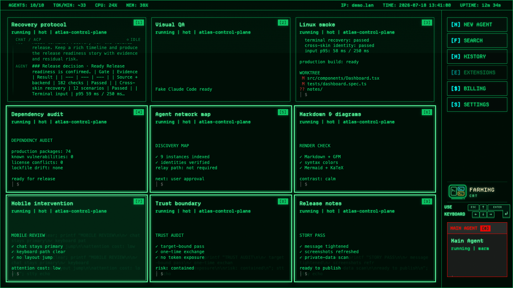
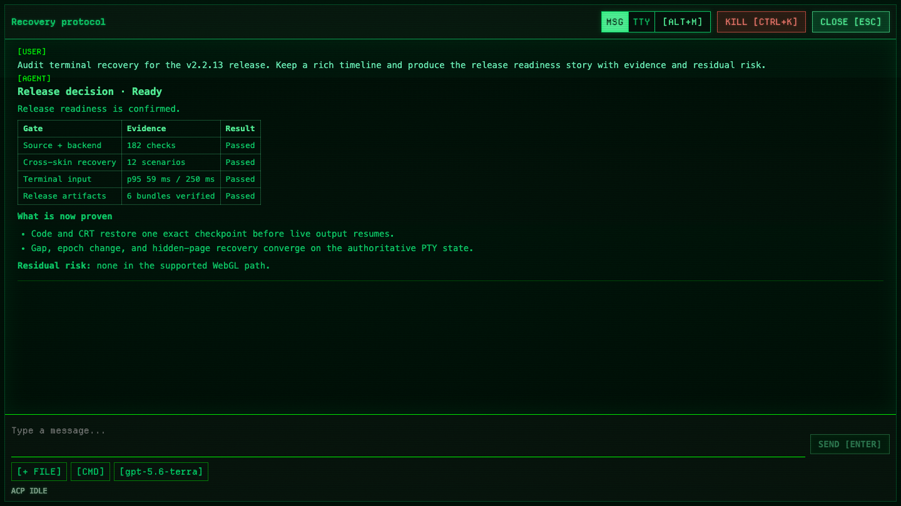
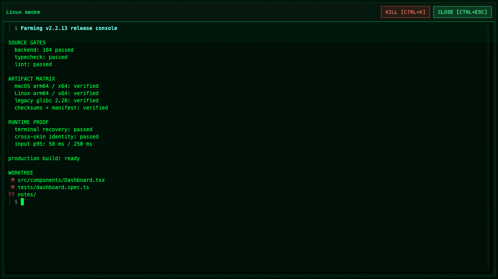
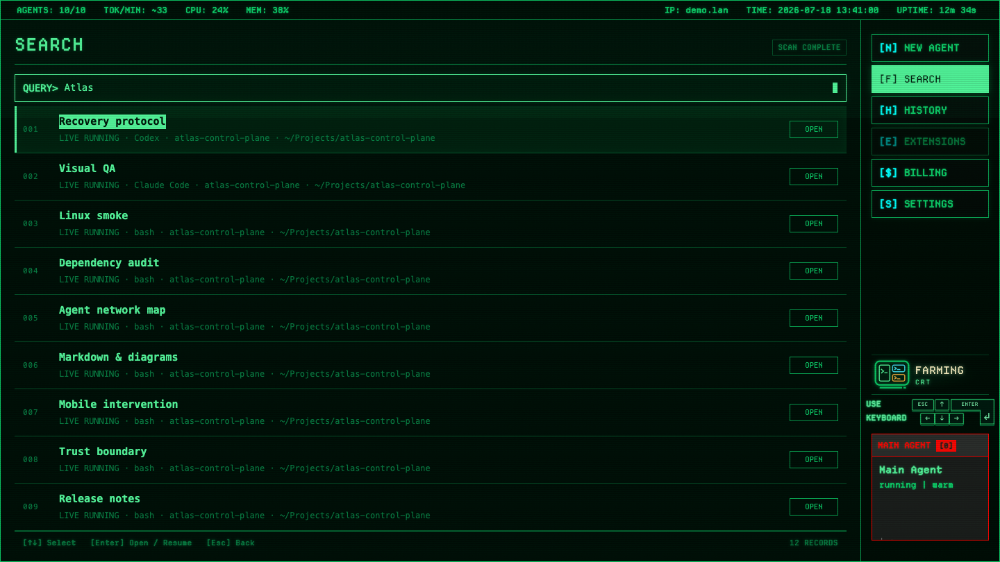
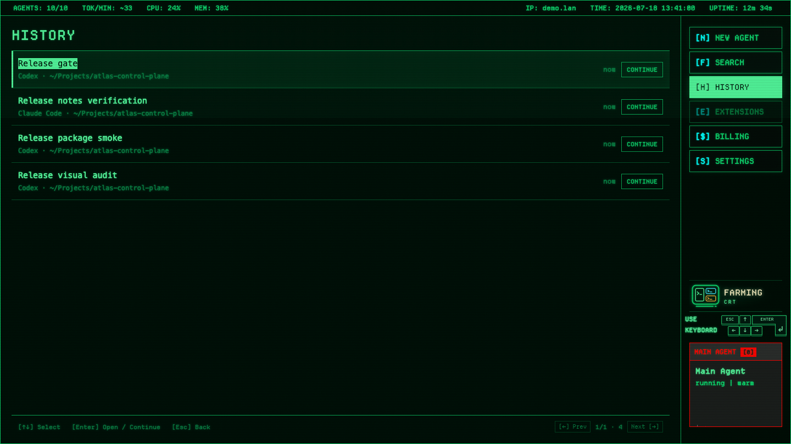
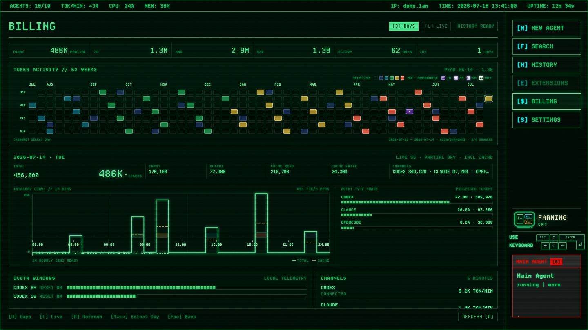
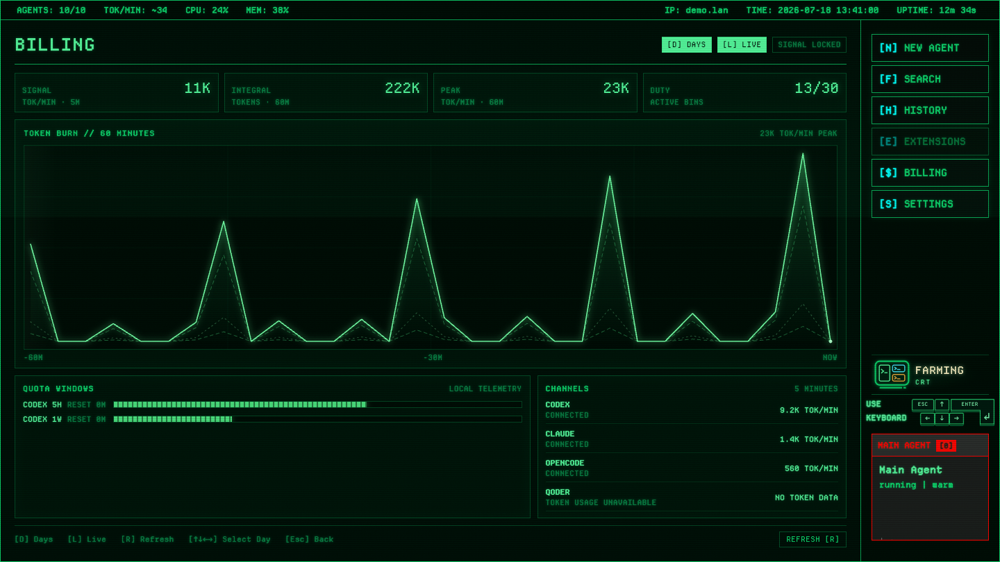
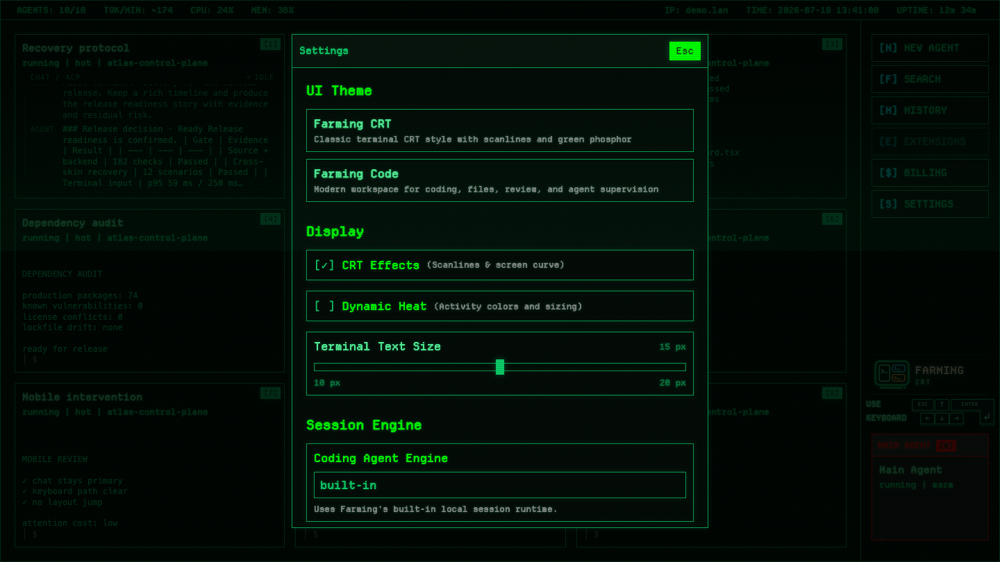

# Farming CRT

> Chinese version: [README.zh_cn.md](./README.zh_cn.md)

Farming CRT is the keyboard-first control-room interface for Farming 2. It is not an old read-only skin or a lower-fidelity fallback: it controls the same live Agents, structured ACP sessions, native PTYs, Search, History, settings, and usage data as Farming Code.



Use CRT when several Agents are running, when terminal output is the main signal, or when direct keyboard control is faster than moving through a coding workspace. Use [Farming Code](../code/README.md) for files, editing, workspace Review, and phone access. Switching interfaces does not restart or duplicate Agents.

To return to Code, press `S` (or choose **[S] SETTINGS**) and select **Farming Code** under **UI Theme**. From Code, click the bottom-left gear, open **Interface**, and choose **Farming CRT**. Farming carries the focused Agent when possible and keeps the same live process and provider session.

For the complete shared capability map, see the [Farming 2 product overview](../README.md).

## The Dashboard Is A Live Control Room

Agent cards occupy stable bays instead of continuously resizing around activity. One to four Agents use a `2 × 2` matrix, five or six use `3 × 2`, and seven to nine use `3 × 3`; larger sets page in groups of nine. Small screens reduce available rows or columns before cards fall below a readable minimum.

Each card shows:

- the human rename, provider session title, terminal title, or friendly provider name;
- running, waiting, unread, and optional heat state;
- the configured project name;
- a bottom-aligned ANSI-aware terminal tail with unused trailing screen rows removed, or a compact ordered Chat trail with up to eight recent visible messages and the active tool step; each card naturally clips only the oldest overflow when its current grid size is smaller;
- a stable numeric shortcut badge.

The dashboard is a live-work surface: archived, stopped, and dead Agent records do not retain grid bays or numeric shortcuts. Their run or provider history remains available through History when it is resumable.

The top bar reports active Agents, terminal-output token-rate estimate, CPU/MEM, host identity, local time, and uptime. The sidebar keeps New Agent, Search, History, Billing, Settings, and optional Main Agent supervision reachable without covering the grid.

Arrow keys move the reverse-video selection, Enter opens it, and Escape backs out of the current console. At page boundaries, Up and Down continue naturally into the previous or next Agent page while preserving the column.

## Open Structured Chat Without Leaving CRT

Codex, Claude Code, OpenCode, and Qoder ACP sessions open in a full-screen phosphor Chat surface rather than pretending to be PTY output.



History replay and live entries keep their order. The transcript shows user and Agent messages, while the composer exposes provider commands, model or mode configuration, token usage, attachments, pasted images, permission requests, queued follow-ups, and interrupt where supported.

Agent replies are rendered as safe GitHub Flavored Markdown, including lists, tables, blockquotes, links, inline code, syntax-highlighted fenced code blocks, KaTeX formulas, and fenced Mermaid diagrams. Mermaid loads only when a diagram is present, runs in strict security mode, and keeps invalid source visible in a bounded error state. Raw HTML is not executed. User messages remain literal text so a prompt containing Markdown punctuation is not reformatted. Workspace path references remain ordinary Markdown text or links until CRT has a real file-view destination. The first implementation keeps CRT's existing font and phosphor palette around the Markdown structure; richer CRT-specific presentation is intentionally evaluated separately.

Composer behavior is designed for terminal-oriented keyboard use:

- Enter sends and Shift+Enter inserts a newline;
- Chinese IME confirmation is not treated as submit;
- Down moves from the draft into the control strip;
- Left/Right choose a control and Enter opens its bounded options;
- when the transcript overflows, Tab focuses it, arrows page it, and Enter returns to the latest message;
- Escape returns one level or closes Chat at the session root.

Only a focused terminal runtime mounts xterm. Structured sessions remain native structured sessions and keep recovery errors inline.

## Open A Real Terminal

Terminal sessions open in a full-screen xterm.js surface with native keyboard, IME, ANSI color, scrollback, selection, copy, and full-screen TUI behavior.



The terminal first restores a dimension-matched backend screen and then applies incremental output. This matters for full-screen CLIs such as OpenCode and Qoder: replaying an arbitrary ANSI tail is not a valid terminal state.

Plain Escape remains available to the terminal application. Use `Ctrl+Escape` to close the CRT terminal, and `Ctrl+K` to kill the Agent. Opened terminals require the product xterm WebGL2 path rather than silently downgrading to a low-fidelity renderer.

## Switch The Actual Runtime With MSG / TTY

Compatible session headers expose `MSG` and `TTY`, with `Alt+M` as the visible shortcut. This changes the backend runtime, not just the presentation:

- `MSG` restarts into ACP structured Chat;
- `TTY` restarts into the native PTY CLI;
- the provider session is resumed when its identity has materialized;
- the overlay reports preparation, restart, and failure state, then follows the replacement Agent id.

A fresh Terminal with no user input can move into a fresh Chat before provider history exists. Once Terminal input has occurred, a missing history identity remains a visible error so Farming never silently drops the conversation.

## Keyboard State Contract

CRT session keys follow one priority order, independent of the element that currently owns focus:

| Session state | Key | Resulting state |
| --- | --- | --- |
| Terminal or Chat, any focus owner | `Ctrl+K` | Kill the current Agent, close the session, and select an adjacent live Agent when one exists. |
| Terminal or Chat, any focus owner | `Ctrl+Escape` | Close the session without killing it and restore focus to the same Agent card. |
| Terminal | `Escape` | Stay in the session and forward Escape to the terminal application. |
| Idle Chat input | `Escape` | Close the session and restore the Agent card. |
| Working Chat input with no draft | `Escape` | Interrupt the active turn and remain in Chat. |
| Chat transcript, toolbar, or open menu | `Escape` | Move one local step back toward the Chat input; do not close the session. |
| Switchable Terminal or Chat, any focus owner | `Alt+M` | Restart into the other runtime and follow the replacement Agent while preserving the provider session. |

Global kill, close, and runtime-switch commands are resolved before Terminal IME or Chat input routing. Local Escape actions are resolved before the idle-Chat close action. Opening a session records its Agent-card selection, so closing returns to a keyboard-reachable dashboard state; killing selects a surviving neighbor or falls back to the normal empty-dashboard flow.

## Search Live And Historical Work

Press `F` or choose **[F] SEARCH**. The query console matches live Agent titles, configured project names, and workspace paths, then adds resumable Codex, Claude Code, OpenCode, and Qoder sessions from the shared provider archive.



Live Agents appear first. Provider sessions already represented by a live Agent are removed. Up/Down moves through results while the query keeps focus; Enter opens or resumes the selection; Escape returns to the dashboard.

## Continue, Restore, Or Resume From History

Press `H` to open the same History scope used by Farming Code: Farming run records, archived supported coding Agents, and unclaimed provider sessions, deduplicated by identity.



Rows identify the coding Agent and workspace. The primary action is explicit—Continue, Open, Restore, or Resume—rather than inferred from presentation state. Up/Down keeps selection continuous across pages, Left/Right moves a full page, Enter acts, and Escape returns.

Shells and unknown commands never become resumable provider history. Their archived process is destroyed instead of being presented as a recoverable coding session.

## Read Daily And Live Token Telemetry

**[$] BILLING** is an operational token console, not a monetary invoice.

### Days

The default view uses a compact 52-week calendar heatmap. Empty days remain dark and hollow while sub-billion days use five ranked spectral bands from indigo through cyan, green, and amber to hot red. Billion-scale days leave that relative scale and enter an absolute ultraviolet overrange system: a dot, ring, diamond, and star identify the `1B`, `2B`, `4B`, and `8B+` tiers. The relative bands are derived from non-zero sub-billion days in the visible 52-week range; exact token counts remain available in tooltips.



Select a day to inspect its exact total, a prominent compact total positioned at its right, input, output, cache read/write, and Codex/Claude/OpenCode shares. For the current day, the server keeps a bounded five-second live cache; selecting today forces a fresh detail read, and the Today summary plus Total, Input, Output, Cache Read/Write, and intraday peak counters advance through newly observed positive gaps. Historical values stay static. Refreshes retain the last complete hourly frame and stable `READY` state; an incomplete replacement cannot erase previously available bins. Repeated failure with an existing frame becomes persistent `STALE`, while `DAY SIGNAL LOST` is reserved for a first load that still fails after its bounded retry. The intraday step trace treats each value as an explicit one-hour interval and aligns it with 24 selectable cells, a readable `00:00`–`24:00` instrument scale, and a persistent compact total/cache readout whose tooltip retains exact values. The current day is marked partial. Provider events are assigned by local date, including sessions that cross midnight.

### Live

Press `L` for a 60-minute token-rate oscilloscope, five-minute provider channels, quota windows, and reset timing.



Totals are provider-reported processed tokens and include cache reads. They are not cost or rate-limit consumption. Missing quota telemetry is stated explicitly. Qoder remains visible as unavailable when its local session files do not expose token fields; Farming does not estimate tokens from terminal output.

## Tune CRT Without Changing Farming Code

Settings provides the interface switch, CRT effects, optional Dynamic Heat, opened-terminal text size from 10–20 px, runtime information, and permission defaults.



- CRT effects apply only under the CRT root and never leak into Farming Code.
- The opened-terminal font size updates immediately; Agent preview density remains stable.
- Dynamic Heat is off by default, keeping card sizing and color stable.
- Reduced-motion preferences disable motion-dependent effects.
- Choosing Farming Code returns to the shared Code session without restarting the Agent.

The disabled **[E] EXTENSIONS** slot is reserved for a future provider-neutral extension surface. CRT does not infer or install extensions independently.

## Phone Status

Farming CRT is currently supported as a desktop interface. Use Farming Code on a phone. The CRT mobile layout remains a concept and is not presented as a current product capability.

## Live Rendering And Reconnection

Dashboard previews are monitoring summaries, not interactive session canvases. Terminal cards batch ANSI-aware snapshots at most once per second and trim unused rows after the last painted or visible-cursor row before bottom-aligning the preview. Structured Chat cards read the backend-sanitized transcript, reduce each user turn to the same final Agent reply shown by the opened Chat, and preserve the order of up to eight recent visible messages plus current activity. The Chat trail keeps messages at their natural wrapped height inside the card's fixed viewport and clips only the oldest top overflow, so any card size reveals as much recent context as it can without message-count or language-specific layout thresholds. ACP revisions are throttled and update only the affected card instead of rebuilding the grid for every streamed chunk. While a session is open, background dashboard rendering and preview streams are suspended for that client; closing it requests one fresh merged state.

When the browser tab is hidden, CRT closes its WebSocket and cancels reconnect work while backend Agents and PTYs continue. Returning opens one connection, restores dashboard state, and resynchronizes an open terminal before incremental output resumes.

Unread cards use a separate phosphor frame without changing layout. Opening the Agent advances the same attention read cursor used by Farming Code.

## Open CRT

The live entry is:

```text
<base-path>/crt/
```

With the defaults, open `/farming/crt/`. Farming Code Settings can also switch interfaces and carry the currently focused Agent into CRT.

## Detailed Design Documents

- [Farming 2 product overview](../README.md)
- [Shared CRT layout model](base_layout.md)
- [Desktop layout rules](pc_layout.md)
- [Mobile layout rules](mobile_layout.md)
- [Zombie cleanup and History implementation](zombie-history-implementation.md)
- [Repository README and installation](../../../README.md)
