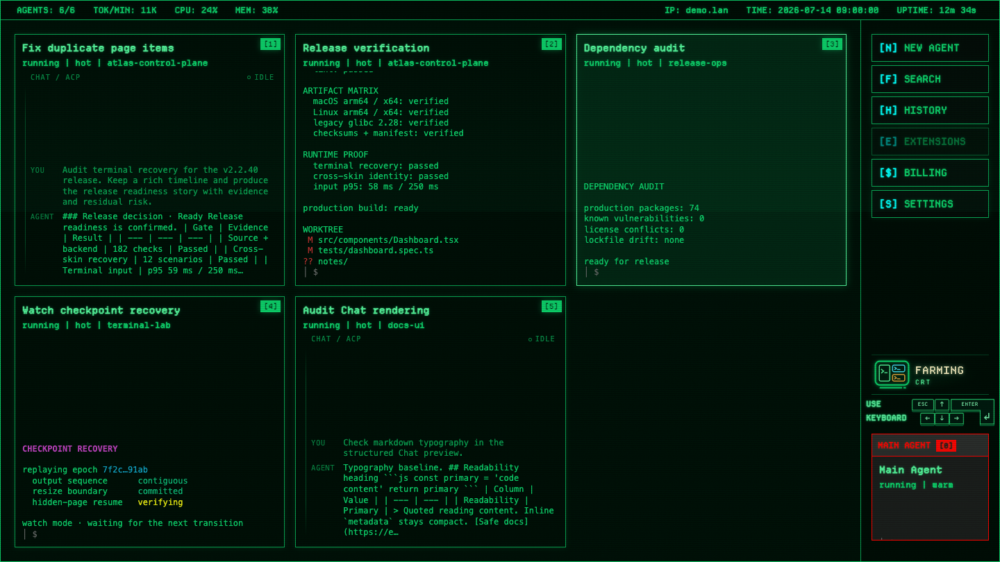

# Farming CRT

> Chinese version: [README.zh_cn.md](./README.zh_cn.md)

Farming CRT is the keyboard-first control-room interface for monitoring and
controlling several Agents.

Use CRT when terminal output and active work are the main signals. Use
[Farming Code](../code/README.md) for files, editing, Review, and phone access.
Both interfaces open the same Agents and Sessions.

## Start

In Farming Code, open **Settings → Interface** and choose **Farming CRT**. In CRT,
press `S` to return to the interface setting.

In CRT Settings, **Content Text Size** changes Chat, its composer, Markdown, and
Terminal content without resizing navigation, status fields, or controls. CRT
keeps this preference separate from Farming Code.

## Common Keys

| Key | Action |
| --- | --- |
| Arrow keys / `Enter` | Select and open an Agent |
| `N` | Start an Agent |
| `F` / `H` | Search / History |
| `Ctrl+Escape` | Close the current Chat or Terminal |
| `Ctrl+K` | Archive the current Agent (`KILL` in the CRT interface) |
| `Alt+M` | Switch a supported Agent between Chat and Terminal |

CRT is currently desktop-only.
